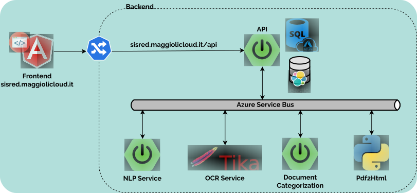
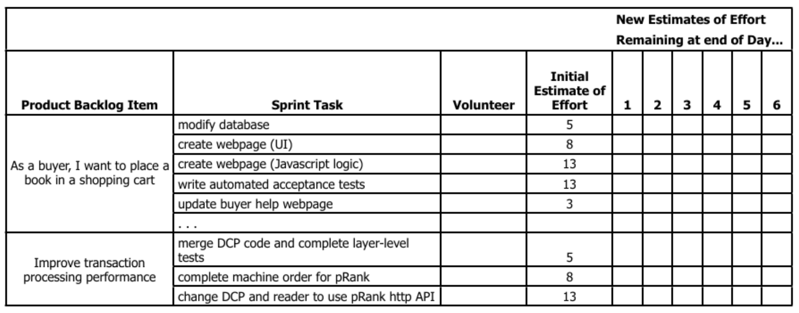

 
+++

title = "DevOps, basics"
description = "Introduction to DevOps and git"
outputs = ["Reveal"]

+++

# DevOps, basics

### *Danilo Pianini*

[danilo.pianini@unibo.it](mailto:danilo.pianini@unibo.it)

---

# Development

* Analysis of a domain
* Design of a solution
* Implementation
* Testing

---

# Operations

* IT infrastructure
* Deployment
* Maintenance

---

# Silo mentality


---

# **No** silos


---

# DevOps culture

* **Increased collaboration**
  * Dev and Ops should *exchange information* and *work together*

* **Shared responsibility**
  * A team is responsible for the (sub) product for its *whole lifetime*
  * *No handing over* projects from devs to ops

* **Autonomous teams**
  * *Lightweight decision making* process

* **Focus on the process, not just the product**
  * Promote small, *incremental changes*
  * *Automate* as much as possible
  * Leverage the right *tool* for the job at hand

---

# Why bother?

1. **Risk management**
    * Reduce the probability of *failure*
    * Detect *defects* before hitting the market
    * Quickly *react* to problems

2. **Resource exploitation**
    * Use *human resources* for human-y work
    * Reduce *time to market*
    * Embrace *innovation*
    * Exploit *emerging technologies*

---

# DevOps

1. **Principles**
2. **Practices**
3. **Tools**

**Principles** *inspire* **practices**

**Practices** *require* **tools**

---

# DevOps principles
### (not exhaustive)


* Collaboration
* Reproducibility
* Automation
* Incrementality
* Robustness

---

# DevOps practices

* *Workflow organization* **$\Leftarrow$** *today's focus!*
* Build automation
* Self-testing code
* Code quality control
* Continuous Integration
* Continuous Delivery
* Continuous Deployment
* Continuous Monitoring

---

# Build automation

The process of creating *tested deployable software artifacts*
<br/>
from *source* code

May include, depending on the system specifics:
* *Source code manipulation* and generation
* Source code *quality assurance*
* *Dependency management*
* *Compilation*, linking
* *Binary manipulation*
* *Test execution*
* Test *quality assurance* (e.g., coverage)
* API *documentation*
* *Packaging*
* *Delivery*

**with no human intervention**

---

# Build automation

* In principle, the lifecycle could be executed manually
* In reality *time is precious* and *repetitivy is boring*

$\Rightarrow$ Create software that automates the building of some software!

---

# Dependency management

* Any software **depends** on other software
    * The *runtime environment*
    * The *core libraries*
    * Possibly *third-party libraries*
    * Possibly *external resources*
* Normally, this *software depends on other software*
    * That *depends on other software*
        * That *depends on other software*
            * That *depends on other software*, and so on...
* A normal applications has a **tree** of dependencies

---

## Simple example: rate a movie

Example **requirements**:
* *Visit* IMDb.org and rottentomatoes (Movie databases)
* *Search* for a title of a movie or series (e.g., Breaking Bad)
* *Print* all available information (director, year, ratings, ...)

[(One possible) solution](https://github.com/APICe-at-DISI/sample-gradle-project/blob/479c733fe730e9995c5c9f7094b405170713c1ca/src/main/java/it/unibo/sampleapp/RateAMovie.java)

---

## The trick: using a few libraries

* **Jooq Jooλ**
    * Unchecked lambda functions
* A **library for OMDB**
    * Queries OMDB given a valid API key, hiding HTTP, communication, and parsing
* **SLF4J + Logback**
    * Logging for Java

---

## Actual dependency tree

```
+--- com.omertron:API-OMDB:1.5
|    +--- commons-codec:commons-codec:1.10
|    +--- org.apache.commons:commons-lang3:3.4
|    +--- com.fasterxml.jackson.core:jackson-core:2.8.7
|    +--- com.fasterxml.jackson.core:jackson-annotations:2.8.7
|    +--- com.fasterxml.jackson.core:jackson-databind:2.8.7
|    |    +--- com.fasterxml.jackson.core:jackson-annotations:2.8.0 -> 2.8.7
|    |    \--- com.fasterxml.jackson.core:jackson-core:2.8.7
|    +--- org.slf4j:slf4j-api:1.7.24 -> 1.7.36
|    \--- org.yamj:api-common:2.1
|         +--- org.apache.httpcomponents:httpclient:4.5.3
|         |    +--- org.apache.httpcomponents:httpcore:4.4.6
|         |    +--- commons-logging:commons-logging:1.2
|         |    \--- commons-codec:commons-codec:1.9 -> 1.10
|         \--- org.slf4j:slf4j-api:1.7.24 -> 1.7.36
+--- org.jooq:jool:0.9.14
+--- org.slf4j:slf4j-api:1.7.36
\--- ch.qos.logback:logback-classic:1.2.11
     +--- ch.qos.logback:logback-core:1.2.11
     \--- org.slf4j:slf4j-api:1.7.32 -> 1.7.36
```

* few *direct* dependencies
* many *transitive* dependencies

In large projects, *transitive* dependencies dominate

---

## Towards a **dependency hell**

* It's common for non-toy projects to get past 50 dependencies
* *Searching*, *downloading* and *verifying compatibility* by hand is unbearable
* **Version conflicts** arise soon
  * one of your direct dependencies uses library A at version 1
  * another uses library A at version 2
  * $\Rightarrow$  *transitive dependency conflict* on A
* **Upgrading** by hand requires, *time*, *effort* and *tons of testing*

---

## Dealing with dependencies

**Source import**

Duplication, more library code than business code, updates almost impossible, inconsistencies, unmaintainable

**Binary import**

Hard to update, [toxic for the VCS](https://bitbucket.org/danysk/exploded-repository-example)

**Desiderata**

* *Declarative* specification of libraries and versions
* *Automatic retrieval*
* Automatic *resolution of transitive dependencies*
* Dependency **scopes**
  * You may need *compile-only*, *test-only*, and *runtime-only* dependencies
* Customizable software *sources*

---

# Continuous Integration

The practice of integrating code with a main development line **continuously**
<br>
_Verifying_ that the build remains intact
* Requires *build automation* to be in place
* Requires *testing* to be in place
* Pivot point of the *DevOps* practices
* Historically introduced by the extreme programming (XP) community
* Now widespread in the larger DevOps community

---

# The Integration Hell

* Traditional software development takes several months for *“integrating”* a couple of years of development
* The longer there is no integrated project, the higher the **risk**


$\Rightarrow$


---

## Microreleases and protoduction

* High frequency integration may lead to high frequency releases
    * Possibly, *one per commit*
    * Of course, *versioning* must be appropriate...

Traditionally, **protoduction** is jargon for a *prototype that ends up in production*

<table>
  <tbody>
    <tr>
      <td>
        
      <td/>
      <td>

* Traditionally used with a *negative* meaning
    * It implied software
        * *unfinished*,
        * *unpolished*,
        * *badly designed*
    * Very common, unfortunately
* This si different in a continuously integrated environment
    * *Incrementality* is fostered
    * Partial features are *up to date* with the mainline

      <td/>
    </tr>
  </tbody>
</table>

---

## Intensive operations should be elsewhere
* The build process should be *rich* and *fast*
* Operations requiring a long time should be *automated*
    * And run somewhere else than devs' PCs

<p>

</p>

---

## Continuous integration

Base idea: build a **pipeline** that *runs the QA* for *every change* in the code base

* Test the integration *before* performing it
* *Automate* as much as possible
* *Release frequently*

---

## Continuous integration software

Software that promotes CI practices should:
* Provide *clean environments* for compilation/testing
* Provide a *wide range* of environments
    * Matching the relevant specifications of the actual targets
* High degree of *configurability*
* Possibly, *declarative configuration*
* A *notification system* to alert about failures or issues
* Support for *authentication* and deployment to external services

**Plenty** of integrators on the market

Circle CI, Travis CI, Werker, done.io, Codefresh, Codeship, Bitbucket Pipelines, GitHub Actions, GitLab CI/CD Pipelines, JetBrains TeamCity...

---

# Core concepts

Naming and organization is variable across platforms, but *in general*:

* One or more **pipelines** can be associated to **events**
  * For instance, a *new change*, an update to a feature, or a *timeout*
* Every pipeline is composed of a **sequence** of **operations**
* Every **operation** could be composed of sequential or parallel **sub-operations**
* How many hierarchical levels are available depends on the specific platform
  * GitHub Actions: *workflow* $\Rightarrow$ *job* $\Rightarrow$ *step* 
  * Travis CI: *build* $\Rightarrow$ *stage* $\Rightarrow$ *job*  $\Rightarrow$ *phase*
* Execution happens in a **fresh system** (virtual machine or container)
  * Sometimes containers inside virtual machines

---

# A real-world test case

We applied DevOps (and microservice-ification) to an existing software project,
measuring some metrics *before* and *after* the operation.

* The detailed *experience report* has been presented at the 37th International Conference on Software Maintenance and Evolution ([ICSME 2021](https://icsme2021.github.io/)) 
    * [Scientific paper](https://doi.org/10.1109/ICSME52107.2021.00051)

---

<iframe width="1280" height="720" src="https://www.youtube.com/embed/6qd6GG3XQXA" title="YouTube video player" frameborder="0" allow="accelerometer; autoplay; clipboard-write; encrypted-media; gyroscope; picture-in-picture" allowfullscreen></iframe>

---

## The target

### Maggioli S.p.A

* *Multinational*, based in Italy
* *~2000 collaborators* at the time of writing
* An *internal IT/Operations* team
* Our target team was composed of **five people**


### sisred (before intervention)

* *Client-server* stand-alone application
* *Delphi* front-end, *Microsoft SQL Server* backend
* Editors (paid by Maggioli) are *experts in law entering information on the client*
* The information is then exposed into a (paid access) *portal* with up-to-date legal information

---

## Previous architecture


---

#

| Metric         | Prev.           | Now  | Change |
| :-------------|:-------------:| :-----:| ---: |
| Release frequency ($\frac{releases}{day}$) | [0.071]() | 
| Commit to release time (hours) |   [8 to 24]() | 
| Commits per day ($\frac{commits}{day}$) | [2]() | 
| MTTR (hours) | [36]() | 
| Prod. env. setup (working hours) | [16]() | 
| Dev. env. setup (minutes) | [120]() |
| Nightly downtime ($\frac{minutes}{night}$) | [30]() | 
| Support ticket frequency ($\frac{tickets}{month}$) | [40]() | 
| Issue resolution time (days) | [4]() |  | 


---

## Microservice-ified architecture



---

## CI Pipeline


---



| Metric         | Prev.           | Now  | Change |
| :-------------|:-------------:| :-----:| ---: |
| Release frequency ($\frac{releases}{day}$) | [0.071]() | *2.7* | **+3700%**
| Commit to release time (hours) |   [8 to 24]() | 
| Commits per day ($\frac{commits}{day}$) | [2]() | 
| MTTR (hours) | [36]() | 
| Prod. env. setup (working hours) | [16]() | 
| Dev. env. setup (minutes) | [120]() |
| Nightly downtime ($\frac{minutes}{night}$) | [30]() | 
| Support ticket frequency ($\frac{tickets}{month}$) | [40]() | 
| Issue resolution time (days) | [4]() |  | 

---



| Metric         | Prev.           | Now  | Change |
| :-------------|:-------------:| :-----:| ---: |
| Release frequency ($\frac{releases}{day}$) | [0.071]() | *2.7* | **+3700%**
| Commit to release time (hours) |   [8 to 24]() | *0.19* | **~ -98.5%**
| Commits per day ($\frac{commits}{day}$) | [2]() | 
| MTTR (hours) | [36]() | 
| Prod. env. setup (working hours) | [16]() | 
| Dev. env. setup (minutes) | [120]() |
| Nightly downtime ($\frac{minutes}{night}$) | [30]() | 
| Support ticket frequency ($\frac{tickets}{month}$) | [40]() | 
| Issue resolution time (days) | [4]() |  | 


---




| Metric         | Prev.           | Now  | Change |
| :-------------|:-------------:| :-----:| ---: |
| Release frequency ($\frac{releases}{day}$) | [0.071]() | *2.7* | **+3700%**
| Commit to release time (hours) |   [8 to 24]() | *0.19* | **~ -98.5%**
| Commits per day ($\frac{commits}{day}$) | [2]() | *7.1* | **+255%**
| MTTR (hours) | [36]() | 
| Prod. env. setup (working hours) | [16]() | 
| Dev. env. setup (minutes) | [120]() |
| Nightly downtime ($\frac{minutes}{night}$) | [30]() | 
| Support ticket frequency ($\frac{tickets}{month}$) | [40]() | 
| Issue resolution time (days) | [4]() |  | 

---




| Metric         | Prev.           | Now  | Change |
| :-------------|:-------------:| :-----:| ---: |
| Release frequency ($\frac{releases}{day}$) | [0.071]() | *2.7* | **+3700%**
| Commit to release time (hours) |   [8 to 24]() | *0.19* | **~ -98.5%**
| Commits per day ($\frac{commits}{day}$) | [2]() | *7.1* | **+255%**
| MTTR (hours) | [36]() | *0.5* | **-98.6%**
| Prod. env. setup (working hours) | [16]() | 
| Dev. env. setup (minutes) | [120]() |
| Nightly downtime ($\frac{minutes}{night}$) | [30]() | 
| Support ticket frequency ($\frac{tickets}{month}$) | [40]() | 
| Issue resolution time (days) | [4]() |  | 

---



| Metric         | Prev.           | Now  | Change |
| :-------------|:-------------:| :-----:| ---: |
| Release frequency ($\frac{releases}{day}$) | [0.071]() | *2.7* | **+3700%**
| Commit to release time (hours) |   [8 to 24]() | *0.19* | **~ -98.5%**
| Commits per day ($\frac{commits}{day}$) | [2]() | *7.1* | **+255%**
| MTTR (hours) | [36]() | *0.5* | **-98.6%**
| Prod. env. setup (working hours) | [16]() | *0.35* | **-97.8%**
| Dev. env. setup (minutes) | [120]() |
| Nightly downtime ($\frac{minutes}{night}$) | [30]() | 
| Support ticket frequency ($\frac{tickets}{month}$) | [40]() | 
| Issue resolution time (days) | [4]() |  | 

---



| Metric         | Prev.           | Now  | Change |
| :-------------|:-------------:| :-----:| ---: |
| Release frequency ($\frac{releases}{day}$) | [0.071]() | *2.7* | **+3700%**
| Commit to release time (hours) |   [8 to 24]() | *0.19* | **~ -98.5%**
| Commits per day ($\frac{commits}{day}$) | [2]() | *7.1* | **+255%**
| MTTR (hours) | [36]() | *0.5* | **-98.6%**
| Prod. env. setup (working hours) | [16]() | *0.35* | **-97.8%**
| Dev. env. setup (minutes) | [120]() | *9* | **-92.5%**
| Nightly downtime ($\frac{minutes}{night}$) | [30]() | 
| Support ticket frequency ($\frac{tickets}{month}$) | [40]() | 
| Issue resolution time (days) | [4]() |  | 

---



| Metric         | Prev.           | Now  | Change |
| :-------------|:-------------:| :-----:| ---: |
| Release frequency ($\frac{releases}{day}$) | [0.071]() | *2.7* | **+3700%**
| Commit to release time (hours) |   [8 to 24]() | *0.19* | **~ -98.5%**
| Commits per day ($\frac{commits}{day}$) | [2]() | *7.1* | **+255%**
| MTTR (hours) | [36]() | *0.5* | **-98.6%**
| Prod. env. setup (working hours) | [16]() | *0.35* | **-97.8%**
| Dev. env. setup (minutes) | [120]() | *9* | **-92.5%**
| Nightly downtime ($\frac{minutes}{night}$) | [30]() | *0* | **-100%**
| Support ticket frequency ($\frac{tickets}{month}$) | [40]() | 
| Issue resolution time (days) | [4]() |  | 

---



| Metric         | Prev.           | Now  | Change |
| :-------------|:-------------:| :-----:| ---: |
| Release frequency ($\frac{releases}{day}$) | [0.071]() | *2.7* | **+3700%**
| Commit to release time (hours) |   [8 to 24]() | *0.19* | **~ -98.5%**
| Commits per day ($\frac{commits}{day}$) | [2]() | *7.1* | **+255%**
| MTTR (hours) | [36]() | *0.5* | **-98.6%**
| Prod. env. setup (working hours) | [16]() | *0.35* | **-97.8%**
| Dev. env. setup (minutes) | [120]() | *9* | **-92.5%**
| Nightly downtime ($\frac{minutes}{night}$) | [30]() | *0* | **-100%**
| Support ticket frequency ($\frac{tickets}{month}$) | [40]() | *19* | **-52.5%**
| Issue resolution time (days) | [4]() |  | 

---



| Metric         | Prev.           | Now  | Change |
| :-------------|:-------------:| :-----:| ---: |
| Release frequency ($\frac{releases}{day}$) | [0.071]() | *2.7* | **+3700%**
| Commit to release time (hours) |   [8 to 24]() | *0.19* | **~ -98.5%**
| Commits per day ($\frac{commits}{day}$) | [2]() | *7.1* | **+255%**
| MTTR (hours) | [36]() | *0.5* | **-98.6%**
| Prod. env. setup (working hours) | [16]() | *0.35* | **-97.8%**
| Dev. env. setup (minutes) | [120]() | *9* | **-92.5%**
| Nightly downtime ($\frac{minutes}{night}$) | [30]() | *0* | **-100%**
| Support ticket frequency ($\frac{tickets}{month}$) | [40]() | *19* | **-52.5%**
| Issue resolution time (days) | [4]() | *3* | **-25%**

---

## Benefits

* Much less **maintenance** in the traditional meaning: *"Time spent to keep the system in nominal conditions"*
    * No more issues with Windows updates
    * No more downtimes related to internal network / electricity / public infrastructure maintenance
    * Improved security
    * No more critical failures caused by testing stored procedures directly in production by mistake
* Much more maintenance in terms of *software evolution*
    * Application (or verification of automatic application) of updates
    * Security audits
    * Maintenance and update of the pipeline

---

## Lessons learned

* The teams must be **autonomous**
* Practices must be *tailored* to the team
* Time-consuming, repetitive, and cumbersome procedures must be *automated*
* Obsolete practices must be *removed*
* **Communication** is key, awareness must be shed across the team of the expected benefits

---

## Timeline


---

# Agile software development

## [Manifesto](http://agilemanifesto.org/)

We are uncovering better ways of developing software by doing it and helping others do it. Through this work we have come to value:

* **Individuals and interactions** over *processes and tools*
* **Working software** over *comprehensive documentation*
* **Customer collaboration** over *contract negotiation*
* **Responding to change** over *following a plan*

That is, while *there is value in the items on the right*, **we value the items on the left more**.

---

## [Agile Principles I](http://agilemanifesto.org/principles.html)
*(emphasis mine)*
**(comments mine)**

1. Our highest priority is to satisfy the customer
through early and *continuous delivery*
of valuable software.

2. Welcome *changing requirements*, even late in
development. Agile processes harness change for
the customer's *competitive advantage*.
**(Not an excuse for not collecting requirements upfront)**

3. *Deliver* working software *frequently*, from a
couple of weeks to a couple of months, with a
preference to the shorter timescale.
**(Daily, hourly)**

4. *Business people and developers must work together* daily throughout the project.
**(And understand each other!)**

5. Build projects around *motivated individuals*.
Give them the environment and support they need,
and *trust* them to get the job done.
**(Teams must be independent)**

6. The most efficient and effective method of
conveying information to and within a development
team is *face-to-face conversation*.
**(Yes, it is pre-covid stuff)**

---

## [Agile Principles II](http://agilemanifesto.org/principles.html)
*(emphasis mine)*
**(comments mine)**

7. *Working software* is the primary measure of progress.
**(But if used as the only measure progress, progress will halt soon)**

0. Agile processes promote *sustainable* development.
The sponsors, developers, and users should be able
to maintain a constant pace indefinitely.
**(Bureaucracy and maintenance task should not pile up)**

0. Continuous attention to *technical excellence*
and *good design* enhances agility.
**(First, do it well)**

0. Simplicity--the art of maximizing the amount
of work not done--is essential.
**(Also known as KISS)**

0. The best architectures, requirements, and designs
emerge from self-organizing teams.

0. At regular intervals, the team reflects on how
to become more effective, then tunes and adjusts
its behavior accordingly.
**(Or, maybe, continuously...)**

---

## Practices vs. Frameworks

**Principles** get reified into *practices*

**Practices** get often interpreted and formalized into *frameworks*

Framework are *actionable*, but formalization may introduce *assumptions about projects and teams that do not hold always!*

**Agile principles and practices** get often captured into these well-known frameworks, with slightly different focuses and goals:
* *Scrum*: focus on team structure, roles, responsibilities, procedures
* *Kanban*: focus on tasks, streamlining, bottleneck mitigation
* *XP (Extreme Programming)*: focus on release frequency
* *Feature Driven Development*: focus on clients' requests and satisfaction
* *Crystal*: focus on self-management of teams
* *DSDM (Dynamic Systems Development Method)*: focus on time and budget constraints

---

# Scrum

Seminal paper from 1986 by Hirotaka Takeuchi and Ikujiro Nonaka:
* [The New New Product Development Game](https://hbr.org/1986/01/the-new-new-product-development-game)

Then refined to the current framework. The name is from Rugby's "scrummage"


---

## Scrum key ideas

* Requirements are *volatile*
* There will be *unpredictability* along the road
* Accept that the problem may not be fully understood upfront, and focus on *quick response* to unexpected changes

---

## Scrum workflow

* The development is divided in **Sprints**
* A Sprint is *timeboxed*: the length is agreed in advance
    * The most commonly adopted length is two weeks
* A Sprint must end with a *deliverable* advancement
* Each sprint is macro-structured as follows:
    1. *Planning*: define the activities of the sprint
    2. *Daily scrums* (aka "stand-up meetings"): daily updates on the state of work
    3. *Sprint review*: at the of the sprint, present the work to the stakeholders
* At regular intervals a *Sprint retrospective* is held
    * Reason on the past sprints with the goal of *continuous improvement*

---

## Scrum roles

* **Product owner (PO)**, *Goal*: maximimizing ROI
    * *Tasks*: identify the necessary features and prioritize them
    * *Vision*: strategic, similar to a product manager, but *understands the product development*!
    * *Interactions*: customers, development team, SM
    * *Responsibilities*: coarse-grained, high-level decision on product directions

* **Development team**, *Goal*: make things happen
    * *Tasks*: build the selected features, provide time estimates, provide feedback to the PO
    * *Vision*: tactic, cross-functional (T-shaped, the team can deal with all the aspects of a sub-project)
    * *Interactions*: PO and SM
    * *Responsibilities*: fine-grained, autonomous and hence accountable

* **Scrum master (SM)**, *Goal*: coaching and supervision
    * *Tasks*: explain Scrum, supervise its application, help learning the methodology
    * *Vision*: process-oriented, expert in Scrum
    * *Interactions*: PO and development team
    * *Responsibilities*: help the team understand and apply Scrum, no formal responsibility on the product.
      Optional (if the team is already experienced), often externalized.

---

## Scrum tools

* **Product backlog**
    * A *prioritized* list of *customer-driven* features
    * Maintained and sorted by the PO
    * Each item has an associated *size estimation* (in arbitrary measure)
    * Refined at the conclusion of each sprint
* **Sprint backlog**
    * *Refines* the product backlog
    * Each product backlog item selected for the current sprint gets split into *sprint tasks*
    * Each task has an *effort estimation*, an *assignee*, and a *progress tracker*
    * The progress is often tracked by updating the "remaining effort" day by day
        * The [burn-down chart](https://en.wikipedia.org/wiki/Burn_down_chart) is a common way to visualize it

---

### Product backlog


---

### Sprint backlog



---


---

## Key concept: **the definition of done**

Apparently simple concept that is *central* for Scrum to work

(and for many other workflows)

Every actor in the process **must agree** and what is the meaning of a task being considered **done**

* Is it done when the acceptance tests work?
* Is it done when the assignee marks it as so?
* Is it done when it is delivered to the main application?
* Is it done when it has been in production for at least one week without bug reports?

---

## Process overview


---

## Workflow overview


---

## The problem with Scrum

Scrum and agile are often used as *synonyms*, but **they are not**

In the literature, Scrum and agile show mixed evidence of efficacy

(even though, anecdotically, many success stories can be found)


### **WARNING: opinions!**

* From now on, facts are mixed with opinions of practitioners (included myself)
* There will be citations. Please note: many authors of these quotes, although regarded professionals, often use agile and Scrum interchangeably
* We are going to ask ourselves to what doesn't work, when, and why
* Let's see if we can find some general guidance...


---

> Waterfall replicates the social model of a dysfunctional organization with a defined hierarchy. Agile, quite often, replicates the social model of a dysfunctional organization *without* a well-defined hierarchy.

* Michael O. Church: [Why “Agile” and especially Scrum are terrible](https://michaelochurch.wordpress.com/2015/06/06/why-agile-and-especially-scrum-are-terrible/)

---

> If your team has combined agile with a legacy methodology such as waterfall, creating a 'water-scrum' approach, you may have the worst of both worlds: You have combined the rigid structure of the traditional approach with the terminology of agile.

* Peter Varhol: [8 reasons to ditch agile](https://techbeacon.com/app-dev-testing/8-reasons-ditch-agile)

---

<iframe id="reddit-embed" src="https://www.redditmedia.com/r/programming/comments/9wcku8/why_agile_and_especially_scrum_are_terrible/e9k4adq/?depth=1&amp;showmore=false&amp;embed=true&amp;showmedia=false" sandbox="allow-scripts allow-same-origin allow-popups" style="border: none;" height="158" width="640" scrolling="no"></iframe>
<iframe id="reddit-embed" src="https://www.redditmedia.com/r/programming/comments/9wcku8/why_agile_and_especially_scrum_are_terrible/e9kccas/?depth=1&amp;showmore=false&amp;embed=true&amp;showmedia=false" sandbox="allow-scripts allow-same-origin allow-popups" style="border: none;" height="139" width="640" scrolling="no"></iframe>
<iframe id="reddit-embed" src="https://www.redditmedia.com/r/programming/comments/9wcku8/why_agile_and_especially_scrum_are_terrible/e9kdpz8/?depth=1&amp;showmore=false&amp;embed=true&amp;showmedia=false" sandbox="allow-scripts allow-same-origin allow-popups" style="border: none;" height="139" width="640" scrolling="no"></iframe>
<iframe id="reddit-embed" src="https://www.redditmedia.com/r/programming/comments/9wcku8/why_agile_and_especially_scrum_are_terrible/e9ka6tj/?depth=1&amp;showmore=false&amp;embed=true&amp;showmedia=false" sandbox="allow-scripts allow-same-origin allow-popups" style="border: none;" height="139" width="640" scrolling="no"></iframe>
<iframe id="reddit-embed" src="https://www.redditmedia.com/r/programming/comments/9wcku8/why_agile_and_especially_scrum_are_terrible/e9kmbvv/?depth=1&amp;showmore=false&amp;embed=true&amp;showmedia=false" sandbox="allow-scripts allow-same-origin allow-popups" style="border: none;" height="139" width="640" scrolling="no"></iframe>
<iframe id="reddit-embed" src="https://www.redditmedia.com/r/programming/comments/9wcku8/why_agile_and_especially_scrum_are_terrible/e9kbutx/?depth=1&amp;showmore=false&amp;embed=true&amp;showmedia=false" sandbox="allow-scripts allow-same-origin allow-popups" style="border: none;" height="163" width="640" scrolling="no"></iframe>

---

<iframe id="reddit-embed" src="https://www.redditmedia.com/r/scrum/comments/t4fun4/query_from_a_sm_of_6_months/?ref_source=embed&amp;ref=share&amp;embed=true" sandbox="allow-scripts allow-same-origin allow-popups" style="border: none;" height="319" width="640" scrolling="no"></iframe>

---

> Many practice the terminology without appreciating the underlying values.

* Peter Varhol: [8 reasons to ditch agile](https://techbeacon.com/app-dev-testing/8-reasons-ditch-agile)

---

> I knew the end of Agile was coming when we started using hockey sticks.

* Kurt Cagle on Forbes: [The End of Agile](https://www.forbes.com/sites/cognitiveworld/2019/08/23/the-end-of-agile/?sh=1bee770a2071)

---

> If management is essentially ignoring the developers, there are fixed deadlines to be achieved with a predefined scope, or it's a dog-eat-dog environment instead of a team focused on achieving the same goal, if planning ahead and thinking out of the box are not appreciated, then yes, eventually you'll give up and resort to just doing the assigned tasks. I've been there.

* From [StackOverflow](https://softwareengineering.stackexchange.com/questions/410482/how-do-i-prevent-scrum-from-turning-great-developers-into-average-developers/410484#410484)

---

> **Standup is effectively "update management".** The notion that standup is for developers is absurd. Does anyone actually wait until 9AM to report a problem or are they going to just ask in the group chat immediately? In practice, it is someone higher up the food chain keeping tabs on how fast things are moving so they can ask about it later in the day.

* Matthew Gaiser [on StackOverflow](https://softwareengineering.stackexchange.com/a/410492/337842)

---

> it usually bends and breaks every other process to it and becomes this overarching process where you do nothing consistently except Scrum rituals and making those Scrum rituals seem successful

* Matthew Gaiser [on StackOverflow](https://softwareengineering.stackexchange.com/a/410492/337842)

---

# What is the root of these issues?

---

## Bureaucratization

* There is a very delicate trade-off between *standardization* of practices and *excess of buraucracy*
* Agile is designed around *co-located medium/small teams* and *low buraucracy* (compared to the state of the art at the time)
* Larger scale requires more coordination and buraucracy
* Smaller scale benefits of less buraucracy

> There is no one-fits-them-all workflow!

**Blindly adopting a pre-existing set of practices may lead to failures**

**Mixing cherry-picked parts of workflows requires a great deal of experience**
* It is paramount that everyone understands *why* some procedure is in place

---

> **It’s stupidly, dangerously short-term.**

* Michael O. Church: [Why “Agile” and especially Scrum are terrible](https://michaelochurch.wordpress.com/2015/06/06/why-agile-and-especially-scrum-are-terrible/)

---

> **Two-week delivery schedules are overkill**

* Peter Varhol: [8 reasons to ditch agile](https://techbeacon.com/app-dev-testing/8-reasons-ditch-agile)

---

# What is the root of these issues?

---

## Time boxes

* Estimating the effort is a *good practice*.
* Replacing reality with estimations *is not*.

* *High-risk/high-gain* activities hardly fit into time slots
    * (hence the "dangerously short-term")

---

> Great developers are often sought out for advice and for second opinions. But any time doing that is less time spent churning out tickets, so their velocity falls.

* Matthew Gaiser [on StackOverflow](https://softwareengineering.stackexchange.com/a/410492/337842)

---

> Scrum and infinite defects can be good friends because the infinite defects approach lets velocity be artificially high as long as bugs are found after the sprint and therefore counted as new work. You could have an ever higher velocity by constantly generating new bugs.

* Matthew Gaiser [on StackOverflow](https://softwareengineering.stackexchange.com/a/410492/337842)

---

> Because the developers are independently working away on each ticket sequentially, the architecture rapidly begins to mirror the tickets. The tickets are typically 1-2 sentence user stories. Ticket driven architecture rapidly gets messy simply because more code gets piled on as required.

* Matthew Gaiser [on StackOverflow](https://softwareengineering.stackexchange.com/a/410492/337842)
---

# What is the root of these issues?

---

## Abuse of KPIs

* Measuring is *good* and *must* be done
* But keep in mind that measures show *a view* over a *complex* system
* Blindly using metrics to measure quality can be perilous

---

> I call this the *Whisky Goggles Effect*: it turns the 3s and 4s into 5s, but it makes you so sloppy that the 7s and 9s want nothing to do with you. Unable to get their creative juices flowing under a system where everything has to be justified in terms of short-term business value, the best programmers leave.

* Michael O. Church: [Why “Agile” and especially Scrum are terrible](https://michaelochurch.wordpress.com/2015/06/06/why-agile-and-especially-scrum-are-terrible/)

*[Emphasis mine]*

---

> Culturally, agile may threaten some team members, including those who feel they had obtained an informal leadership status under the previous process that disappeared under agile.

* Peter Varhol: [8 reasons to ditch agile](https://www.reddit.com/r/programming/comments/9wcku8/comment/e9lcdaf/?utm_source=share&utm_medium=web2x&context=3)

---

<iframe id="reddit-embed" src="https://www.redditmedia.com/r/programming/comments/9wcku8/why_agile_and_especially_scrum_are_terrible/e9lcdaf/?depth=2&amp;showmore=false&amp;embed=true&amp;showtitle=true&amp;context=1&amp;showmedia=false" sandbox="allow-scripts allow-same-origin allow-popups" style="border: none;" height="411" width="640" scrolling="no"></iframe>

---

<iframe id="reddit-embed" src="https://www.redditmedia.com/r/programming/comments/9wcku8/why_agile_and_especially_scrum_are_terrible/e9kclup/?depth=1&amp;showmore=false&amp;embed=true&amp;showmedia=false" sandbox="allow-scripts allow-same-origin allow-popups" style="border: none;" height="236" width="640" scrolling="no"></iframe>

---

> developers who think they are under pressure will do a crappy job in any development methodology

* From [StackOverflow](https://softwareengineering.stackexchange.com/a/410494/337842)

---

> Great developers are usually defined as those who can solve tough problems. Scrum encourages picking work that can easily be done and rapidly churned out at a steady pace. A tough problem is a developer being slow on getting the tickets done.

* Matthew Gaiser [on StackOverflow](https://softwareengineering.stackexchange.com/a/410492/337842)

---

> Teams might self organize if they all have the same goal and incentives. The problem is, that is rarely true. One guy wants a promotion. Another is studying for a degree on the side. A third is upskilling to go to another company. Another just doesn't want to have arguments so agrees to anything and lets the codebase become a mess. A lot of good design requires the developers to sit down and hash out how a thing should work.

* Matthew Gaiser [on StackOverflow](https://softwareengineering.stackexchange.com/a/410492/337842)

---

> Even if you get a situation where you are not formally judged on the points completed (which will not happen if management is mostly interacting during Scrum rituals as that is all they have to see regarding progress), people are still going to compete for attention and rewards.

* Matthew Gaiser [on StackOverflow](https://softwareengineering.stackexchange.com/a/410492/337842)

---

> Just imagine 11 people being handed a soccer manual and being told practice is every day for fifteen minutes around 10 AM in conference room #5. Do you think that is what makes a good soccer team? But what if those 11 people were really good, professional players? Still no team? No. Even Christiano Ronaldo would be getting "average" sooner or later with that kind of "team". But that's not soccer's fault. It's just not how you build a team.

* Matthew Gaiser [on StackOverflow](https://softwareengineering.stackexchange.com/questions/410482/how-do-i-prevent-scrum-from-turning-great-developers-into-average-developers/410491#410491)

---

# What is the root of these issues?

---

## Managing teams is hard
## *agile alone does not make it easier*

* Daily standups may become source of *pressure*
    * *especially if management is involved*
    * autonomy requires trust!
* Changes in consolidated practices have *hidden costs*
    * they challenge a pre-existent stabiity
    * and I have no idea how to deal with them
    * (well you tell me)

**opinion warning below** 
* Developer quality is not linear
* One insanely good developer can be worth 5 good developers alone
    * still they don't get paid five times as much, and they know it
* One good developer can be worth 5 average developers, and so on
* $\Rightarrow$ flattening towards average is usually damaging

---

> Many practice the terminology without appreciating the underlying values.

* Peter Varhol: [8 reasons to ditch agile](https://techbeacon.com/app-dev-testing/8-reasons-ditch-agile)

---

> If you really don't have an agile methodology but call it agile to attract and retain developers and other team members, you are in trouble.

* Peter Varhol: [8 reasons to ditch agile](https://techbeacon.com/app-dev-testing/8-reasons-ditch-agile)

---

# What is the root of these issues?

---

## Find solid *processes*, not just a nice packaging

* It is easy to transform agile principles into a set of *rituals*
    * See bureaucratization
* Don't do Scrum because is cool, do it **because**:
    1. *you understand it*
    2. you have good reasons to think it will *help*
    3. Don't be fearful of adapting it to the environment

---

> In Scrum, you need to clear tickets and there is no real check on the quality of the work as "done" or "not done" is decided by a usually non-technical project owner. That incentivizes going into a void and focusing on outputting code.

* Matthew Gaiser [on StackOverflow](https://softwareengineering.stackexchange.com/a/410492/337842)

---

> The high level of developer independence means each developer takes different approaches. [...] While it is not necessarily wrong, it makes debugging a heck of a lot harder as more places need to be checked.

* Matthew Gaiser [on StackOverflow](https://softwareengineering.stackexchange.com/a/410492/337842)

---

# What is the root of these issues?

---

## Technical excellence

* Working in a persistent *emergency state* creates *technical debt*
* *Architectures* and *abstractions* are vital for long-term success
    * If they get compromised, they need to be recovered
    * (which is *paying your techical debt*)
* There should be *consistency* across styles and techniques
    * And controls should be as much as possible automatic

## Knowledge gaps and definition of done

* The **definition of done** is central
    * Arguably, it should include the *technical debt*
* Involve technical experts when defining what *done* means
    * Especially if you intend to *measure people performance* based on how much they have *done*

---

# Doing it right

* **Know your project**, there is no universal process that works every time
* **Know your team**, there is no universal recipe that works everywhere
* Avoid *ritualization*! Processes are not religions
* Agree on the *definition of done*
* Break down problems in smaller chunks, but *do not foget the long-term vision*
* Sacrify excellence for velocity only when there is an *emergency*
* When in "**emergency** mode", be aware that you are accumulating *technical debt* that must be paid
* Avoid *shortcuts* that break *abstractions* and *architectures*
* Enforce excellence by *strict QA* processes
* Beware of *scoring individuals*, as they will likely begin to *chase the metrics* in response
* Development is a *creative work*, excessive *management pressure* is likely to make things worse

---

# Tracking changes

Did you ever need to *roll back* to a previous version?

How did you track the *history* of the project?

### Classic way

1. find a naming convention for files/folders
2. make a copy every time there is some relevant progress
3. make a copy every time an ambitious but risky development begins

**Inefficient!**
* Consumes a lot of resources
* Requires time
* How to tell what was in some previous releases?
* How to cherry-pick some changes?

---

## Fostering collaborative workflows

Did you ever need to develop some project or assignment *as a team*?

How did you organize the work to *maximize the productivity*?

### Classic ways

* *One screen, many heads*
  * a.k.a. one works, the other ones sleep
* *Locks*: "please do not touch section 2, I'm working on that"
  * probability of arising conflicts close to 100%
* *Realtime-sharing* (like google docs or overleaf)
  * okay in many cases for text documents (but with a risk of frankestein-ization)
  * disruptive with code (inconsistencies are much less tolerable in formal languages)

---

## Version control systems

Tools meant to support the development of projects by:
* Tracking the project *history*
* Allowing *roll-backs*
* Collecting *meta-information* on the changes
  * Authors, dates, notes...
* *Merging* information produced at different stages
* (in some cases) *facilitate parallel workflows*
* **Distributed** vs. *Centralized*
  * **Every developer has a whole copy of the entire history**
  * *There exist a central point of synchronization*
* Also called Source Content Management (SCM)

---

## Short history

* **Concurrent Versioning System (CVS)** (1986): client-server (*centralized* model, the truth is on the server), operates on single files or repository-level, history stored in a hidden directory, uses delta compression to save space.
* **Apache Subversion (SVN)** (2000): successor to CVS, still largely used (especially in businesses that struggle to renovate their processes). *Centralized* model (similar to CVS). Improved binary file management. Improved concurrency for the operation, still cumbersome for parallel workflows.
* **Mercurial** and **Git** (both April 2005): *decentralized* version control systems (DVCSs), no "special" copy of the repository, each client stores the whole history. Highly scalable. Foster parallel work by allowing easy branching and merging. Very similar conceptually (when two succesful tools emerge at the same time with a similar model independently, it is an indication that the underlying model is "the right one" for the context).

**Git** is now the dominant DVCS (although Mercurial is still in use, e.g., for Python, Java, Facebook).

---

## Distributed version control: concepts

* **Repository**: project *meta-data*.
  Includes the information about the project history, how to roll changes back,
  authors, dates, differences between "saves", and so on.
* **Working Tree** (or worktree, or working directory): the collection of *files* (usually, inside a folder) that constitute the project.
  The version control system tracks changes to the working tree.
* **Commit**: a *saved status* of the project.
  Depending on the operation, it can be seen as the collection of *changes* required to transform the previous (*parent*) save into the current (differential tracking),
  or as a *snapshot* of the status of the worktree (snapshotting).
  It includes metadata about the author, the date, and a *message* summarizing the changes, and a unique *identifier*.
  A commit with no parent is an *initial commit*.
  A commit with multiple parents is a *merge commit*.
* **Branch**: a *sequence of commits* (more precisely, a directed acyclic graph)
* **Head**: a pointer to the *current commit*: when a new commit is performed,
  the head becomes the parent commit of the newly created commit,
  and then moves to point to the new commit.
* **Checkout**: *moves the head* to a commit, possibly updating the some or all the files in the working tree.
* **Merge**: *fusion of divergent branches*, generates a *merge commit*

---

## Visual representation

A *single branch*, linear development.

* every oval is a *commit*
* black arrows point to the *parent commit*
* orange boxes are *labels* (symbolic names of commits)

---

1. first commit

  digraph G {
    fontname="Helvetica,Arial,sans-serif"
   	node [fontname="Helvetica,Arial,sans-serif"]
  	edge [fontname="Helvetica,Arial,sans-serif"]
    rankdir=LR;
    "HEAD -> branch_name" [style="filled,solid", shape=box, fillcolor=orange];
    C1 -> "HEAD -> branch_name" [dir=back, penwidth=4, color=orange];
  }


2. second commit


  digraph G {
    fontname="Helvetica,Arial,sans-serif"
   	node [fontname="Helvetica,Arial,sans-serif"]
  	edge [fontname="Helvetica,Arial,sans-serif"]
    rankdir=LR;
    C1 -> C2 [dir=back];
    "HEAD -> branch_name" [style="filled,solid", shape=box, fillcolor=orange];
    C2 -> "HEAD -> branch_name" [dir=back, penwidth=4, color=orange];
  }


---


---


  digraph G {
    fontname="Helvetica,Arial,sans-serif"
   	node [fontname="Helvetica,Arial,sans-serif"]
  	edge [fontname="Helvetica,Arial,sans-serif"]
    rankdir=LR;
    C1 -> C2 -> C3 -> C4 -> C5 -> C6 [dir=back];
    "HEAD -> branch_name" [style="filled,solid", shape=box, fillcolor=orange];
    C6 -> "HEAD -> branch_name" [dir=back, penwidth=4, color=orange];
  }


Oh, no, there was a mistake! We need to roll back!

---

## *checkout of C4*


  digraph G {
    fontname="Helvetica,Arial,sans-serif"
   	node [fontname="Helvetica,Arial,sans-serif"]
  	edge [fontname="Helvetica,Arial,sans-serif"]
    rankdir=LR;
    C1 -> C2 -> C3 -> C4 -> C5 -> C6 [dir=back];
    HEAD, branch_name [style="filled,solid", shape=box, fillcolor=orange];
    C4 -> HEAD [dir=back, penwidth=4, color=orange];
    C6 -> branch_name [dir=back, penwidth=4, color=orange];
  }


* No information is lost, we can get back to `C6` whenever we want to.
* what if we commit now?

---

## Branching!


  digraph G {
    fontname="Helvetica,Arial,sans-serif"
   	node [fontname="Helvetica,Arial,sans-serif"]
  	edge [fontname="Helvetica,Arial,sans-serif"]
    rankdir=LR;
    C1 -> C2 -> C3 -> C4 -> C5 -> C6 [dir=back];
    C4 -> C7 [dir=back]
    "HEAD -> another_branch", branch_name [style="filled,solid", shape=box, fillcolor=orange];
    C7 -> "HEAD -> another_branch" [dir=back, penwidth=4, color=orange];
    C6 -> branch_name [dir=back, penwidth=4, color=orange];
  }


* Okay, but there was useful stuff in `C5`, I'd like into `another_branch`

---

## Merging!


  digraph G {
    fontname="Helvetica,Arial,sans-serif"
   	node [fontname="Helvetica,Arial,sans-serif"]
  	edge [fontname="Helvetica,Arial,sans-serif"]
    rankdir=LR;
    C1 -> C2 -> C3 -> C4 -> C5 -> C6 [dir=back];
    C4 -> C7 [dir=back]
    C5 -> C7 [dir=back]
    "HEAD -> another_branch", branch_name [style="filled,solid", shape=box, fillcolor=orange];
    C7 -> "HEAD -> another_branch" [dir=back, penwidth=4, color=orange];
    C6 -> branch_name [dir=back, penwidth=4, color=orange];
  }


**Notice that:**
* we have two branches
* merge `C7` is a merge commit: it has two parents `C4` and `C5`
* the situation is the same regardless that is a *single developer going back on the development* or *multiple developers working in parallel*!
* this is possible because *every copy of the repository contains the entire history*!

---

## Reference DVCS: Git

De-facto reference distributed version control system

* *Distributed*
* Born in *2005* to replace BitKeeper as SCM for the Linux kernel
  * Performance was a major concern
  * Written in C
* Developed by Linus Torvalds
  * Now maintained by others
* *Unix-oriented*
  * Tracks Unix file permissions
* Very *fast*
  * At conception, 10 times faster than Mercurial¹, 100 times faster than Bazaar

¹ Less difference now, Facebook vastly improved Mercurial

---

## Funny historical introduction



---

## Approach: terminal-first

#### (actually: terminal-only)

**Git is a command line tool**

Although graphical interfaces exsist, it makes no sense to learn a GUI:
* they are more prone to future changes than the CLI
* they add a level of interposition between you and the tool
* unless they are incomplete, they expose *more complexity* than what we can deal with in this course
  * what do you do with a checkbox labeled "squash when merging"?
  * and what about *recursively checkout submodules*?
* as soon as you learn *the CLI*, you become so proficient that you get *slower* when there is a graphical interface in-between

**I am assuming minimal knowledge of the shell, please let me know NOW if you've never seen it**

---

## Initializing a repository

### `git init`
* Initializes a new repository *inside the current directory*
* Reified in the `.git` folder
* The location of the `.git` folder marks the root of the repository
  * Do not nest repositories inside repositories, it is fragile
  * Nested projects are realized via *submodules* (not discussed in this course)
* **Beware of the place where you issue the command!**
  * First use `cd` to locate yourself inside the folder that contains (or will containe the project)
    * (possibly, first create the folder with `mkdir`)
  * **Then** issue `git init`
  * if something goes awry, you can delete the repository by deleting the `.git` folder.

---

## Staging

Git has the concept of *stage* (or *index*).
* Changes must be added to the stage to be committed.
* Commits save the *__changes__ included in the stage*
  * Files changed after being added to the stage neet to be re-staged
* `git add <files>` moves the current state of the files into the stage as *changes*
* `git reset <files>` removes currently staged *changes* of the files from stage
* `git commit` creates a new *changeset* with the contents of the stage



---

## Observing the repository status

It is extremely important to understand *clearly* what the current state of affairs is
* Which *branch* are we working on?
* Which *files* have been *modified*?
* Which *changes* are already *staged*?

`git status` prints the current state of the repository, example output:

```lisp
❯ git status
On branch master
Your branch is up to date with 'origin/master'.

Changes to be committed:
  (use "git restore --staged <file>..." to unstage)
        modified:   content/_index.md
        new file:   content/dvcs-basics/_index.md
        new file:   content/dvcs-basics/staging.png

Changes not staged for commit:
  (use "git add <file>..." to update what will be committed)
  (use "git restore <file>..." to discard changes in working directory)
        modified:   layouts/shortcodes/gravizo.html
        modified:   layouts/shortcodes/today.html
```

---

## Committing

* Requires an *author* and an *email*
  * They can be configured globally (at the computer level):
    * `git config --global user.name 'Your Real Name'`
    * `git config --global user.email 'your@email.com'`
  * The global settings can be overridden at the repository level
    * e.g., you want to commit with a different email between work and personal projects
    * `git config user.name 'Your Real Name'`
    * `git config user.email 'your@email.com'`
* Requires a **message**, using appropriate messages is **extremely important**
  * If unspecified, the commit does not get performed
  * it can be specified inline with `-m`, otherwise Git will pop up the default editor
    * `git commit -m 'my very clear and explanatory message'`
* The *date* is recorded automatically
* The *commit identifier* (a cryptographic hash) is generated automatically

---

## Default branch

At the first commit, there is no branch and no `HEAD`.

Depending on the version of Git, the following behavior may happen upon the first commit:
* Git creates a *new branch* named `master`
  * *legacy behavior*
  * the name is inherited from the default branch name in *Bitkeeper*
* Git creates a *new branch* named `master`, but warns that it is a deprecated behavior
  * although coming from the Latin "*magister*" (teacher) and not from the "master/slave" model of asymmetric communication control, many recently prefer `main` as seen as more inclusive
* Git refuses to commit until a default branch name is specified
  * *modern behavior*
  * Requires configuration: `git config --global init.defaultbranch default-branch-name`

---

## Ignoring files

In general, we do not want to track *all* the files in the repository folder:
* Some files could be *temporary* (e.g., created by the editor)
* Some files could be *regenerable* (e.g., compiled binaries and application archives)
* Some files could contain *private* information

Of course, we could just not `add` them, but the error is around the corner!

It would be much better to just tell Git to ignore some files.

This is achieved through a *special `.gitignore` file*.
  * the file must be named `.gitignore`, names like `foo.gitignore` or `gitignore.txt` won't work
    * A good way to create/append to this file is via `echo whatWeWantToIgnore >> .gitignore` (multiplatform command)
  * it is a list of paths that git will ignore (unless `git add` is called with the `--force` option)
  * it is possible to add exceptions

---

## `.gitignore` example

```.gitignore
# ignore the bin folder and all its contents
bin/
# ignore every pdf file
*.pdf
# rule exception (beginning with a !): pdf files named 'myImportantFile.pdf' should be tracked
!myImportantFile.pdf
```

---

## Dealing with removal and renaming of files

* The removal of a file is a legit *change*
* As we discussed, `git add` adds a *change* to the stage
* **the change can be a removal!**

`git add someDeletedFile` is a correct command, that will stage the fact that `someDeletedFile` does not exist anymore, and its deletion must be registered at the next `commit`.

* File *renaming* is *equivalent to file deletion and file creation* where, incidentally, the new file has the same content of the deleted file
* To stage the rinomination of file `foo` into `bar`:
  * `git add foo bar`
  * it records that `foo` has been deleted and `bar` has been created
  * Git is smart enough to understand that it is a name change, and will deal with it *efficiently*

---

## Visualizing the history

Of course, it is useful to visualize the history of commits.
Git provides a dedicated sub-command:

`git log`

* opens a *navigable interactive view* of the history from the `HEAD` commit (the current commit) backwards
  * Press <kbd>Q</kbd>
* *compact* visualization: `git log --oneline`
* visualization of *all branches*: `git log --all`
* visualization of a lateral *graph*: `git log --graph`
* compact visualization of all branches with a graph: `git log --oneline --all --graph`

---

### example output of `git log --oneline --all --graph`

```
* d114802 (HEAD -> master, origin/master, origin/HEAD) moar contribution
| * edb658b (origin/renovate/gohugoio-hugo-0.94.x) ci(deps): update gohugoio/hugo action to v0.94.2
|/  
* 4ce3431 ci(deps): update gohugoio/hugo action to v0.94.1
* 9efa88a ci(deps): update gohugoio/hugo action to v0.93.3
* bf32a8b begin with build slides
* b803a65 lesson 1 looks ready
* 6a85f8f ci(deps): update gohugoio/hugo action to v0.93.2
* b474d2a write more on the introductory lesson
* 8a7105e ci(deps): update gohugoio/hugo action to v0.93.1
* 6e40642 begin writing the first lesson
```

---

## Referring to commits: `<tree-ish>`es

In git, a reference to a commit is called `<tree-ish>`. Valid `<tree-ish>`es are:
* Full *commit hashes*, such as `b82f7567961ba13b1794566dde97dda1e501cf88`.
* *Shortened commit hashes*, such as `b82f7567`.
* *Branch names*, in which case the reference is to the last commit of the branch.
* `HEAD`, a special name referring to the current commit (the head, indeed).
* *Tag names* (we will discuss what a tag is later on).

---

## Relative references

It is possible to build *relative references*, e.g., "get me the commit before this `<tree-ish>`",
by following the commit `<tree-ish>` with a tilde (`~`) and with the number of parents to get to:
* `<tree-ish>~STEPS` where `STEPS` is an integer number produces a reference to the `STEPS-th` parent of the provided `<tree-ish>`:
  * `b82f7567~1` references the *parent* of commit `b82f7567`.
  * `some_branch~2` refers to the *parent of the parent* of the last commit of branch `some_branch`.
  * `HEAD~3` refers to the *parent of the parent of the parent* of the current commit.

* In case of merge commits (with multiple parents), `~` selects the first one
* Selection of parents can be performed with caret in case of multiple parents (`^`)
  * We won't go in depth here, but:
    * The [`git rev-parse` reference on specifying revision](https://git-scm.com/docs/git-rev-parse#_specifying_revisions) is publicly available
    * A [much more readable explanation can be found on Stack overflow](https://stackoverflow.com/a/2222920/1916413)

---

## Visualizing the differences

We want to see which *differences* a commit introduced, or what we modified in some files of the work tree

Git provides support to visualize the changes in terms of *modified lines* through `git diff`:
* `git diff` shows the difference between the *stage* and the *working tree*
  * namely, what you would stage if you perform a `git add`
* `git diff --staged` shows the difference between `HEAD` and the *working tree*
* `git diff <tree-ish>` shows the difference between `<tree-ish>` and the *working tree* (*stage excluded*)
* `git diff --staged <tree-ish>` shows the difference between `<tree-ish>` and the *working tree*, *including staged changes*
* `git diff <from> <to>`, where `<from>` and `<to>` are `<tree-ish>`es, shows the differences between `<from>` and `<to>`

---

### `git diff` Example output:

```diff
diff --git a/.github/workflows/build-and-deploy.yml b/.github/workflows/build-and-deploy.yml
index b492a8c..28302ff 100644
--- a/.github/workflows/build-and-deploy.yml
+++ b/.github/workflows/build-and-deploy.yml
@@ -28,7 +28,7 @@ jobs:
           # Idea: the regex matcher of Renovate keeps this string up to date automatically
           # The version is extracted and used to access the correct version of the scripts
           USES=$(cat <<TRICK_RENOVATE
-          - uses: gohugoio/hugo@v0.94.1
+          - uses: gohugoio/hugo@v0.93.3
           TRICK_RENOVATE
           )
           echo "Scripts update line: \"$USES\""
```

The output is compatible with the Unix commands `diff` and `patch`

Still, *binary files are an issue*! Tracking the right files is paramount.

---

## Navigating the history

Navigation of the history concretely means to move the head (in Git, `HEAD`) to arbitrary points of the history

In Git, this is performed with the `checkout` commit:
* `git checkout <tree-ish>`
  * Unless there are changes that could get lost, *moves* `HEAD` to the provided `<tree-ish>`
  * Updates all tracked files to their version at the provided `<tree-ish>`

The command can be used to selectively checkout a file from another revision:
* `git checkout <tree-ish> -- foo bar baz`
  * Restores the status of files `foo`, `bar`, and `baz` from commit `<tree-ish>`, and adds them to the stage (unless there are uncommitted changes that could be lost)
  * Note that `--` is surrounded by whitespaces, it is not a `--foo` option, it is just used as a separator between the `<tree-ish>` and the list of files
    * the files could be named as a `<tree-ish>` and we need disambiguation

---

## Detached head

Git does **not** allow *multiple heads per branch*
(other DVCS do, in particular Mercurial):
for a commit to be valid, `HEAD` must be at the "end" of a branch (on its last commit), as follows:


  digraph G {
    fontname="Helvetica,Arial,sans-serif"
   	node [fontname="Helvetica,Arial,sans-serif"]
  	edge [fontname="Helvetica,Arial,sans-serif"]
    rankdir=LR;
    # Commits
    C0 -> C1 -> C2 -> C3 -> C4 -> C5 -> C6 [dir=back];
    # Branches
    node [style="filled,solid", shape=box, fillcolor=orange];
    edge [dir=back, penwidth=4, color=orange];
    C6 -> HEAD;
    C6 -> master;
    # Head
    edge [dir=forward, arrowhead=tee, penwidth=2, color=red];
    HEAD -> master [label="attached"];
  }


When an old commit is checked out this condition doesn't hold, if we run `git checkout HEAD~4`:


  digraph G {
    fontname="Helvetica,Arial,sans-serif"
   	node [fontname="Helvetica,Arial,sans-serif"]
  	edge [fontname="Helvetica,Arial,sans-serif"]
    rankdir=LR;
    # Commits
    C0 -> C1 -> C2 -> C3 -> C4 -> C5 -> C6 [dir=back];
    # Branches
    node [style="filled,solid", shape=box, fillcolor=orange];
    edge [dir=back, penwidth=4, color=orange];
    C2 -> HEAD;
    C6 -> master;
    # Head
    edge [dir=forward, arrowhead=tee, penwidth=2, color=red];
    nowhere [style=invis,shape=point]
    HEAD -> nowhere [label="detached"];
  }


The system enters a special workmode called *detached head*.

When **in detached head**, Git allows to make **commits**, but they **are lost**!

(Not really, but to retrieve them we need `git reflog` and `git cherry-pick`, that we won't discuss)

---

### Creating branches

To store our commits, we need to *create* a **branch**, then attach the `HEAD` by checking it out.

In Git, new branches are created with `git branch branch_name`


  digraph G {
    fontname="Helvetica,Arial,sans-serif"
   	node [fontname="Helvetica,Arial,sans-serif"]
  	edge [fontname="Helvetica,Arial,sans-serif"]
    rankdir=LR;
    # Commits
    C0 -> C1 -> C2 -> C3 -> C4 -> C5 -> C6 [dir=back];
    # Branches
    node [style="filled,solid", shape=box, fillcolor=orange];
    edge [dir=back, penwidth=4, color=orange];
    C2 -> HEAD;
    C6 -> master;
    # Head
    edge [dir=forward, arrowhead=tee, penwidth=2, color=red];
    nowhere [style=invis,shape=point]
    HEAD -> nowhere [label="detached"];
  }



⬇️ `git branch new-experiment` ⬇️


  digraph G {
    fontname="Helvetica,Arial,sans-serif"
   	node [fontname="Helvetica,Arial,sans-serif"]
  	edge [fontname="Helvetica,Arial,sans-serif"]
    rankdir=LR;
    # Commits
    C0 -> C1 -> C2 -> C3 -> C4 -> C5 -> C6 [dir=back];
    # Branches
    node [style="filled,solid", shape=box, fillcolor=orange];
    edge [dir=back, penwidth=4, color=orange];
    C2 -> HEAD;
    C6 -> master;
    C2 -> "new-experiment";
    # Head
    edge [dir=forward, arrowhead=tee, penwidth=2, color=red];
    nowhere [style=invis,shape=point]
    HEAD -> nowhere [label="detached"];
  }


---


  digraph G {
    fontname="Helvetica,Arial,sans-serif"
   	node [fontname="Helvetica,Arial,sans-serif"]
  	edge [fontname="Helvetica,Arial,sans-serif"]
    rankdir=LR;
    # Commits
    C0 -> C1 -> C2 -> C3 -> C4 -> C5 -> C6 [dir=back];
    # Branches
    node [style="filled,solid", shape=box, fillcolor=orange];
    edge [dir=back, penwidth=4, color=orange];
    C2 -> HEAD;
    C6 -> master;
    C2 -> "new-experiment";
    # Head
    edge [dir=forward, arrowhead=tee, penwidth=2, color=red];
    nowhere [style=invis,shape=point]
    HEAD -> nowhere [label="detached"];
  }


⬇️ `git checkout new-experiment` ⬇️


  digraph G {
    fontname="Helvetica,Arial,sans-serif"
   	node [fontname="Helvetica,Arial,sans-serif"]
  	edge [fontname="Helvetica,Arial,sans-serif"]
    rankdir=LR;
    # Commits
    C0 -> C1 -> C2 -> C3 -> C4 -> C5 -> C6 [dir=back];
    # Branches
    node [style="filled,solid", shape=box, fillcolor=orange];
    edge [dir=back, penwidth=4, color=orange];
    C2 -> HEAD;
    C6 -> master;
    C2 -> "new-experiment";
    # Head
    edge [dir=forward, arrowhead=tee, penwidth=2, color=red];
    HEAD -> "new-experiment" [label="attached"];
  }


---

## One-shot branch creation

As you can imagine, creating a *new branch* and *attaching `HEAD`* to the freshly created branch is pretty common

When an operation is very common, usually a short-hand is provided:
* `git checkout -b new-branch-name`
* Creates `new-branch-name` from the current position of `HEAD`
* Attaches `HEAD` to `new-branch-name`


  digraph G {
    fontname="Helvetica,Arial,sans-serif"
   	node [fontname="Helvetica,Arial,sans-serif"]
  	edge [fontname="Helvetica,Arial,sans-serif"]
    rankdir=LR;
    # Commits
    C0 -> C1 -> C2 -> C3 -> C4 -> C5 -> C6 [dir=back];
    # Branches
    node [style="filled,solid", shape=box, fillcolor=orange];
    edge [dir=back, penwidth=4, color=orange];
    C2 -> HEAD;
    C6 -> master;
    # Head
    edge [dir=forward, arrowhead=tee, penwidth=2, color=red];
    nowhere [style=invis,shape=point]
    HEAD -> nowhere [label="detached"];
  }


⬇️ `git checkout -b new-experiment` ⬇️


  digraph G {
    fontname="Helvetica,Arial,sans-serif"
   	node [fontname="Helvetica,Arial,sans-serif"]
  	edge [fontname="Helvetica,Arial,sans-serif"]
    rankdir=LR;
    # Commits
    C0 -> C1 -> C2 -> C3 -> C4 -> C5 -> C6 [dir=back];
    # Branches
    node [style="filled,solid", shape=box, fillcolor=orange];
    edge [dir=back, penwidth=4, color=orange];
    C2 -> HEAD;
    C6 -> master;
    C2 -> "new-experiment";
    # Head
    edge [dir=forward, arrowhead=tee, penwidth=2, color=red];
    HEAD -> "new-experiment" [label="attached"];
  }



---

## Merging branches

Reunifying diverging development lines is *much trickier* than spawning new development lines

In other words, *merging* is **much trickier** than *branching*

* Historically, with *centralized* version control systems, merging was considered extremely delicate and difficult
* The *distributed* version control systems promoted *frequent*, *small-sized* merges, much easier to deal with
* **Conflicts** *can still arise!*
  * what if we change the same line of code in two branches differently?

In Git, `git merge target` merges the branch named `target` into the current branch (`HEAD` must be attached)

---

## Merge visual example


  digraph G {
    fontname="Helvetica,Arial,sans-serif"
   	node [fontname="Helvetica,Arial,sans-serif"]
  	edge [fontname="Helvetica,Arial,sans-serif"]
    rankdir=LR;
    # Commits
    C0 -> C1 -> C2 -> C3 -> C4 -> C5 -> C6 [dir=back];
    C4 -> C7 -> C8 [dir=back];
    # Branches
    node [style="filled,solid", shape=box, fillcolor=orange];
    edge [dir=back, penwidth=4, color=orange];
    C8 -> HEAD;
    C6 -> master;
    C8 -> "new-experiment";
    # Head
    edge [dir=forward, arrowhead=tee, penwidth=2, color=red];
    HEAD -> "new-experiment" [label="attached"];
  }


⬇️ `git merge master` ⬇️


  digraph G {
    fontname="Helvetica,Arial,sans-serif"
   	node [fontname="Helvetica,Arial,sans-serif"]
  	edge [fontname="Helvetica,Arial,sans-serif"]
    rankdir=LR;
    # Commits
    C0 -> C1 -> C2 -> C3 -> C4 -> C5 -> C6 -> C9 [dir=back];
    C4 -> C7 -> C8 -> C9 [dir=back];
    # Branches
    node [style="filled,solid", shape=box, fillcolor=orange];
    edge [dir=back, penwidth=4, color=orange];
    C9 -> HEAD;
    C6 -> master;
    C9 -> "new-experiment";
    # Head
    edge [dir=forward, arrowhead=tee, penwidth=2, color=red];
    HEAD -> "new-experiment" [label="attached"];
  }



---

## Fast forwarding

Consider this situation:


  digraph G {
    fontname="Helvetica,Arial,sans-serif"
   	node [fontname="Helvetica,Arial,sans-serif"]
  	edge [fontname="Helvetica,Arial,sans-serif"]
    rankdir=LR;
    # Commits
    C0 -> C1 -> C2 -> C3 -> C4 -> C5 -> C6 [dir=back];
    # Branches
    node [style="filled,solid", shape=box, fillcolor=orange];
    edge [dir=back, penwidth=4, color=orange];
    C4 -> HEAD;
    C6 -> master;
    C4 -> "new-experiment";
    # Head
    edge [dir=forward, arrowhead=tee, penwidth=2, color=red];
    HEAD -> "new-experiment" [label="attached"];
  }


* We want `new-experiment` to also have the changes in `C5` and `C6` (to be up to date with `master`)
* `master` contains all the commits of `new-experiment`
* We don't really need a merge commit, we can just move `new-experiment` to point it to `C6`
* $\Rightarrow$ This is called a **fast-forward**
  * It is the *default behavior* in Git when merging branches where the target is the head plus something


  digraph G {
    fontname="Helvetica,Arial,sans-serif"
   	node [fontname="Helvetica,Arial,sans-serif"]
  	edge [fontname="Helvetica,Arial,sans-serif"]
    rankdir=LR;
    # Commits
    C0 -> C1 -> C2 -> C3 -> C4 -> C5 -> C6 [dir=back];
    # Branches
    node [style="filled,solid", shape=box, fillcolor=orange];
    edge [dir=back, penwidth=4, color=orange];
    C6 -> master;
    C6 -> HEAD;
    C6 -> "new-experiment";
    # Head
    edge [dir=forward, arrowhead=tee, penwidth=2, color=red];
    HEAD -> "new-experiment" [label="attached"];
  }


---

## Merge conflicts

Git tries to resolve most conflicts by *itself*
* It's *pretty good* at it
* but things can still require *human intervention*

In case of conflict on one or more files, Git marks the subject files as *conflicted*, and modifies them adding *merge markers*:

```bash
<<<<<<< HEAD
Changes made on the branch that is being merged into,
this is the branch currently checked out (HEAD).
=======
Changes made on the branch that is being merged in.
>>>>>>> other-branch-name
```

* The user should *change the conflicted files* so that they reflect the *final desired status*
* The (now fixed) files should get added to the stage with `git add`
* The merge operation can be concluded through `git commit`
  * In case of merge, the message is pre-filled in

---

## Good practices

**Avoiding merge conflicts is *much* better than solving them**

Although they are unavoidable in some cases, they can be *minimized* by following a few *good practices*:

* **Do not** *track files that can be generated*
  * This is harmful under many points of view, and merge conflicts are one
* **Do** *make many small commits*
  * Each coherent change should be reified into a commit
  * Even very small changes, like modification of the whitespaces
  * Smaller commits help Git better figure out what changed and in which order,
  generally leading to finer grained (and easier to solve) conflicts
* **Do** *enforce style rules* across the team
  * Style changes are legitimate changes
  * Style is often enforced at the IDE level
  * Minimal logical changes may cause widespread changes due to style modifications
* **Do** *pay attention to newlines*
  * Different OSs use different newline characters
  * Git tries to be smart about it, often failing catastrophically

---

## Going to a new line is more complicated than it seems

Going to a new line is a two-phased operation:
1. Bring the cursor back to the begin of the line
2. Bring the cursor down one line

In *electromechanic teletypewriters* (and in typewriters, too), they were two distinct operations:
1. *Carriage Return* (bringing the carriage to its leftmost position)
2. *Line Feed* (rotating the carriage of one step)

---

## A teletypewriter

* driving them text without drivers required to *explicitly send* *carriage return* and *line feed* commands


---

## Newlines in the modern world

Terminals were designed to behave like virtual teletypewriters
* Indeed, they are still called **TTY** (**T**ele**TY**pewriter)
* In Unix-like systems, they are still implemented as *virtual devices*
  * If you have MacOS X or Linux, you can see which virtual device backs your current terminal using `tty`
* At some point, Unix decided that `LF` was sufficient in virtual TTYs to go to a new line
  * Probably *inspired by the C language*, where `\n` means "newline"
  * The behaviour can still be disabled
```bash
we would get
            lines
                 like these
```

####  Consequence:
* Windows systems go to a new line with a `CR` character followed by an `LF` character: `\r\n`
* Unix-like systems go to a new line with an `LF` character: `\n`
* Old Mac systems used to go to a new line with a `CR` character: `\r`
  * Basically they decided to use a single character like Unix did, but made the opposite choice
  * MacOS X is POSIX-compliant, uses `\n`

---

## Newlines and version control

If your team uses *multiple OSs*, it is likely that, by default, the text editors use either `LF` (on Unix) or `CRLF`

It is also very likely that, upon saving, the whole file gets rewritten with the "*locally* correct" *line endings*

* This however would result in *all the lines being changed*!
* The differential would be huge
* *Conflicts would arise everywhere*!

Git tries to tackle this issue by converting the line endings so that they match the initial line endings of the file,
resulting in repositories with *illogically mixed line endings*
(depending on who created a file first)
and loads of warnings about `LF`/`CRLF` conversions.

Line endings should instead be **configured per file type!**

---

## `.gitattributes`

* A sensible strategy is to use `LF` everywhere, but for Windows scripts (`bat`, `cmd`, `ps1`)
* Git can be configured through a `.gitattributes` file in the repository root
  * It can do [much more than enforcing line endings](https://git-scm.com/docs/gitattributes), actually
* Example: 
```
* text=auto eol=lf
*.[cC][mM][dD] text eol=crlf
*.[bB][aA][tT] text eol=crlf
*.[pP][sS]1 text eol=crlf
```

---

## Associating symbolic names to commits

It is often handful to associate some commits with a *symbolic name*,
most of the time to assign *versions*.
* e.g., identify commit `8d400c0` as version `1.2.3`

Although in principle *branches* could be used to do so, their nature is of *moving labels*:
when `HEAD` is attached, new commits move the branch forward.
We would like to have *branches to which `HEAD` cannot attach* (hence, they can't be moved from their creation point).


  digraph G {
    fontname="Helvetica,Arial,sans-serif"
   	node [fontname="Helvetica,Arial,sans-serif"]
  	edge [fontname="Helvetica,Arial,sans-serif"]
    rankdir=LR;
    # Commits
    C0 -> C1 -> C2 -> C3 -> C4 -> C5 -> C6 [dir=back];
    # Branches
    node [style="filled,solid", shape=box, fillcolor=orange];
    edge [dir=back, penwidth=4, color=orange];
    C6 -> master;
    C6 -> HEAD;
    # Head
    edge [dir=forward, arrowhead=tee, penwidth=2, color=red];
    HEAD -> master [label="attached"];
  }



⬇️ `git checkout C4 && git branch 1.2.3 && git checkout master` ⬇️


  digraph G {
    fontname="Helvetica,Arial,sans-serif"
   	node [fontname="Helvetica,Arial,sans-serif"]
  	edge [fontname="Helvetica,Arial,sans-serif"]
    rankdir=LR;
    # Commits
    C0 -> C1 -> C2 -> C3 -> C4 -> C5 -> C6 [dir=back];
    # Branches
    node [style="filled,solid", shape=box, fillcolor=orange];
    edge [dir=back, penwidth=4, color=orange];
    C6 -> master;
    C6 -> HEAD;
    C4 -> "1.2.3"
    # Head
    edge [dir=forward, arrowhead=tee, penwidth=2, color=red];
    HEAD -> master [label="attached"];
  }


---

## Branches as attachable (and movable) labels


  digraph G {
    fontname="Helvetica,Arial,sans-serif"
   	node [fontname="Helvetica,Arial,sans-serif"]
  	edge [fontname="Helvetica,Arial,sans-serif"]
    rankdir=LR;
    # Commits
    C0 -> C1 -> C2 -> C3 -> C4 -> C5 -> C6 [dir=back];
    # Branches
    node [style="filled,solid", shape=box, fillcolor=orange];
    edge [dir=back, penwidth=4, color=orange];
    C6 -> master;
    C6 -> HEAD;
    C4 -> "1.2.3"
    # Head
    edge [dir=forward, arrowhead=tee, penwidth=2, color=red];
    HEAD -> master [label="attached"];
  }


Looks good, but if we do something like: ⬇️ `git checkout 1.2.3` [some changes] `git commit` ⬇️


  digraph G {
    fontname="Helvetica,Arial,sans-serif"
   	node [fontname="Helvetica,Arial,sans-serif"]
  	edge [fontname="Helvetica,Arial,sans-serif"]
    rankdir=LR;
    # Commits
    C0 -> C1 -> C2 -> C3 -> C4 -> C5 -> C6 [dir=back];
    C4 -> C7 [dir=back];
    # Branches
    node [style="filled,solid", shape=box, fillcolor=orange];
    edge [dir=back, penwidth=4, color=orange];
    C6 -> master;
    C6 -> HEAD;
    C7 -> "1.2.3"
    # Head
    edge [dir=forward, arrowhead=tee, penwidth=2, color=red];
    HEAD -> master [label="attached"];
  }



Our version **moved**, *we never want this to happen*!

---

## Tagging

The `tag` subcommand to create *permanent labels* attached to commits.
Tags come in two fashions:
* **Lightweight** *tags* are very similar to a "permanent branch": *pointers to commits that never change*
* **Annotated** *tags* store additional information: a *message*, and, optionally, a *signature*
  * created by adding the `-a` option (or `-s`/`-u` for signed tags)


  digraph G {
    fontname="Helvetica,Arial,sans-serif"
   	node [fontname="Helvetica,Arial,sans-serif"]
  	edge [fontname="Helvetica,Arial,sans-serif"]
    rankdir=LR;
    # Commits
    C0 -> C1 -> C2 -> C3 -> C4 -> C5 -> C6 [dir=back];
    # Branches
    node [style="filled,solid", shape=box, fillcolor=orange];
    edge [dir=back, penwidth=4, color=orange];
    C6 -> master;
    C6 -> HEAD;
    # Head
    edge [dir=forward, arrowhead=tee, penwidth=2, color=red];
    HEAD -> master [label="attached"];
  }


⬇️ `git checkout C4 && git tag 1.2.3` ⬇️


  digraph G {
    fontname="Helvetica,Arial,sans-serif"
   	node [fontname="Helvetica,Arial,sans-serif"]
  	edge [fontname="Helvetica,Arial,sans-serif"]
    rankdir=LR;
    # Commits
    C0 -> C1 -> C2 -> C3 -> C4 -> C5 -> C6 [dir=back];
    # Branches
    node [style="filled,solid", shape=box, fillcolor=orange];
    edge [dir=back, penwidth=4, color=orange];
    C4 -> HEAD;
    C6 -> master;
    # Tags
    node [style="filled,solid", shape=box, fillcolor=cyan];
    C4 -> "1.2.3"
    # Head
    edge [dir=forward, arrowhead=tee, penwidth=2, color=red];
    nowhere [style=invis,shape=point]
    HEAD -> nowhere [label="detached"];
  }


`HEAD` cannot attach to tags!

---

## Branches as labels: deletion

As we discussed, *branches* in Git work like *special labels* that move forward if `HEAD` is attached to them and commit is performed.

Also, the *history* tracked by git is a *directed acyclic graph* (each commit has a reference to its parents)

$\Rightarrow$ *Branches can be removed without information loss*, as far as there is at least *another branch* from which *all the commits* of the deleted branch are *reachable*

Branch deletion is performed with `git branch -d branch-name`. It is *safe* (fails if there is potential information loss).


  digraph G {
    fontname="Helvetica,Arial,sans-serif"
   	node [fontname="Helvetica,Arial,sans-serif"]
  	edge [fontname="Helvetica,Arial,sans-serif"]
    rankdir=LR;
    # Commits
    C0 -> C1 -> C2 -> C3 -> C4 -> C5 -> C6 [dir=back];
    C4 -> C7
    # Branches
    node [style="filled,solid", shape=box, fillcolor=orange];
    edge [dir=back, penwidth=4, color=orange];
    C6 -> master;
    C7 -> "feat/serverless";
    C3 -> "fix/bug22";
    # Head
    C6 -> HEAD;
    edge [dir=forward, arrowhead=tee, penwidth=2, color=red];
    HEAD -> master [label="attached"];
  }


⬇️ `git branch -d fix/bug22` ⬇️


  digraph G {
    fontname="Helvetica,Arial,sans-serif"
   	node [fontname="Helvetica,Arial,sans-serif"]
  	edge [fontname="Helvetica,Arial,sans-serif"]
    rankdir=LR;
    # Commits
    C0 -> C1 -> C2 -> C3 -> C4 -> C5 -> C6 [dir=back];
    C4 -> C7
    # Branches
    node [style="filled,solid", shape=box, fillcolor=orange];
    edge [dir=back, penwidth=4, color=orange];
    C6 -> master;
    C7 -> "feat/serverless";
    # Head
    C6 -> HEAD;
    edge [dir=forward, arrowhead=tee, penwidth=2, color=red];
    HEAD -> master [label="attached"];
  }


No commit is lost, branch `fix/bug22` is removed
* `git branch -d feat/serverless` would **fail** with an error message, as `C7` would be lost

---

## Importing a repository

* We can initialize an **emtpy** repository with `git init`
* But most of the time we want to start from a *local copy* of an **existing** repository

Git provides a `clone` subcommand that copies *the whole history* of a repository locally
* `git clone URI destination` creates the folder `destination` and clones the repository found at `URI`
  * If `destination` is not empty, fails
  * if `destination` is omitted, a folder with the same namen of the last segment of `URI` is created
  * `URI` can be remote or local, Git supports the `file://`, `https://`, and `ssh` protocols
      * `ssh` *recommended* when available
* The `clone` subcommand checks out the remote branch where the `HEAD` is attached (*default branch*)

Examples:
```bash
# creates a local folder called `destination` and copies the repository from the local directory
git clone /some/repository/on/my/file/system destination
# creates a local folder called `myfolder` and copies the repository located at the specified `URL`
git clone https://somewebsite.com/someRepository.git myfolder
# creates a local folder called `SomeRepo` and copies the repository located at the specified `URL`
git clone user@sshserver.com:SomePath/SomeRepo.git
```

---

## Remotes

* Remotes are the *known copies* of the repository that exist somewhere (usually in the Internet)
* Each remote has a *name* and a *URI*
* When a repository is created via `init`, no remote is known.
* When a repository is imported via `clone`, a remote called `origin` is created automatically

*Non-local branches can be referenced* as `remoteName/branchName`

The `remote` subcommand is used to inspect and manage remotes:
* `git remote -v` *lists* the known remotes    C3 -> "fix/bug22";

* `git remote add a-remote URI` *adds* a new remote named `a-remote` and pointing to `URI`
* `git remote show a-remote` displays *extended information* on `a-remote`
* `git remote remove a-remote` *removes* `a-remote` (it does not delete information on the remote, it *locally* forgets that it exits)

---

## Upstream branches

Remote branches can be *associated* with local branches, with the intended meaning that the local and the remote branch are *intended to be two copies of the same branch*

* A remote branch associated to a local branch is its **upstream branch**
* upstream branches can be configured via `git branch --set-upstream-to=remote/branchName`
  * e.g.: `git branch --set-upstream-to=origin/develop` sets the current branch upstream to `origin/develop`
* When a repository is initialize by `clone`, its default branch is checked out locally with the same name it has on the remote, and the remote branch is automatically set as *upstream*

---

### Actual result of `git clone git@somesite.com/repo.git`


  digraph G {
    fontsize="20"
    fontname="Helvetica,Arial,sans-serif"
   	node [fontname="Helvetica,Arial,sans-serif"]
  	edge [fontname="Helvetica,Arial,sans-serif"]
    rankdir=LR;
    compound=true

    subgraph cluster_remote {
      color=black
      label="somesite.com/repo.git"
      
      # Commits
      C0r [label=C0]
      C1r [label=C1]
      C2r [label=C2]
      C3r [label=C3]
      C4r [label=C4]
      C5r [label=C5]
      C6r [label=C6]
      C7r [label=C7]
      C0r -> C1r -> C2r -> C3r -> C4r [dir=back];
      C2r -> C5r -> C6r -> C7r [dir=back];
      
      # Branches
      node [style="filled,solid", shape=box, fillcolor=orange];
      edge [dir=back, penwidth=4, color=orange];
      master_r [label=master];
      feat_r [label="feat/new-client"]
      C4r -> master_r;
      C7r -> feat_r;

      # Head
      HEAD_r [label=HEAD];
      C4r -> HEAD_r;
      edge [dir=forward, arrowhead=tee, penwidth=2, color=red];
      HEAD_r -> master_r [arrowhead=tee, penwidth=2, color=red, label="attached"];
    }

    subgraph cluster_local {
      label="Local"
      color=black
      
      # Commits
      C0 -> C1 -> C2 -> C3 -> C4 [dir=back];
      
      # Branches
      node [style="filled,solid", shape=box, fillcolor=orange];
      edge [dir=back, penwidth=4, color=orange];
      C4 -> master;

      # Head
      C4 -> HEAD;
      edge [dir=forward, arrowhead=tee, penwidth=2, color=red, label=""];
      HEAD -> master [label="attached"];

      # Upstreams
      edge [arrowhead=dot, dir=forward, penwidth=2, color=blue];
      master -> master_r [label="upstream"];
      
      # Remotes
      node [style="filled,solid", shape=box, fillcolor=aquamarine3];
      edge [arrowhead=dot, dir=forward, penwidth=3, color=aquamarine3];
      origin -> C4r [lhead=cluster_remote]
    }
  }


* `git@somesite.com/repo.git` is saved as `origin`
* The main branch (the branch where `HEAD` is attached, in our case `master`) on `origin` gets checked out locally with the same name
* The local branch `master` is set up to track `origin/master` as upstream
* Additional branches are *fetched* (they are known locally), but they are not checked out

---

## Importing remote branches

`git branch` (or `git checkout -b`) can checkout remote branches locally *once they have been fetched*.


  digraph G {
    fontname="Helvetica,Arial,sans-serif"
    fontsize="20"
   	node [fontname="Helvetica,Arial,sans-serif"]
  	edge [fontname="Helvetica,Arial,sans-serif"]
    rankdir=LR;
    compound=true

    subgraph cluster_remote {
      color=black
      label="somesite.com/repo.git"
      
      # Commits
      C0r [label=C0]
      C1r [label=C1]
      C2r [label=C2]
      C3r [label=C3]
      C4r [label=C4]
      C5r [label=C5]
      C6r [label=C6]
      C7r [label=C7]
      C0r -> C1r -> C2r -> C3r -> C4r [dir=back];
      C2r -> C5r -> C6r -> C7r [dir=back];
      
      # Branches
      node [style="filled,solid", shape=box, fillcolor=orange];
      edge [dir=back, penwidth=4, color=orange];
      master_r [label=master];
      feat_r [label="feat/new-client"]
      C4r -> master_r;
      C7r -> feat_r;

      # Head
      HEAD_r [label=HEAD];
      C4r -> HEAD_r;
      edge [dir=forward, arrowhead=tee, penwidth=2, color=red];
      HEAD_r -> master_r [arrowhead=tee, penwidth=2, color=red, label="attached"];
    }

    subgraph cluster_local {
      label="Local"
      color=black
      
      # Commits
      C0 -> C1 -> C2 -> C3 -> C4 [dir=back];
      
      # Branches
      node [style="filled,solid", shape=box, fillcolor=orange];
      edge [dir=back, penwidth=4, color=orange];
      C4 -> master;

      # Head
      C4 -> HEAD;
      edge [dir=forward, arrowhead=tee, penwidth=2, color=red];
      HEAD -> master [label="attached"];

      # Upstreams
      edge [arrowhead=dot, dir=forward, penwidth=2, color=blue];
      master -> master_r [label="upstream"];
      
      # Remotes
      node [style="filled,solid", shape=box, fillcolor=aquamarine3];
      edge [arrowhead=dot, dir=forward, penwidth=3, color=aquamarine3];
      origin -> C0r [lhead=cluster_remote]
    }

  }


⬇️ `git checkout -b imported-feat origin/feat/new-client` ⬇️


  digraph G {
    fontname="Helvetica,Arial,sans-serif"
    fontsize="20"
   	node [fontname="Helvetica,Arial,sans-serif"]
  	edge [fontname="Helvetica,Arial,sans-serif"]
    rankdir=LR;
    compound=true

    subgraph cluster_remote {
      color=black
      label="somesite.com/repo.git"
      
      # Commits
      C0r [label=C0]
      C1r [label=C1]
      C2r [label=C2]
      C3r [label=C3]
      C4r [label=C4]
      C5r [label=C5]
      C6r [label=C6]
      C7r [label=C7]
      C0r -> C1r -> C2r -> C3r -> C4r [dir=back];
      C2r -> C5r -> C6r -> C7r [dir=back];
      
      # Branches
      node [style="filled,solid", shape=box, fillcolor=orange];
      edge [dir=back, penwidth=4, color=orange];
      master_r [label=master];
      feat_r [label="feat/new-client"]
      C4r -> master_r;
      C7r -> feat_r;

      # Head
      HEAD_r [label=HEAD];
      C4r -> HEAD_r;
      edge [dir=forward, arrowhead=tee, penwidth=2, color=red];
      HEAD_r -> master_r [arrowhead=tee, penwidth=2, color=red, label="attached"];
    }

    subgraph cluster_local {
      label="Local"
      color=black
      
      # Commits
      C0 -> C1 -> C2 -> C3 -> C4 [dir=back];
      C2 -> C5 -> C6 -> C7 [dir=back];
      
      # Branches
      node [style="filled,solid", shape=box, fillcolor=orange];
      edge [dir=back, penwidth=4, color=orange];
      C4 -> master;
      C7 -> "imported-feat";

      # Head
      C7 -> HEAD;
      edge [dir=forward, arrowhead=tee, penwidth=2, color=red];
      HEAD -> "imported-feat" [label="attached"];

      # Upstreams
      edge [arrowhead=dot, dir=forward, penwidth=2, color=blue];
      master -> master_r [label="upstream"];
      "imported-feat" -> feat_r [label="upstream"];
      
      # Remotes
      node [style="filled,solid", shape=box, fillcolor=aquamarine3];
      edge [arrowhead=dot, dir=forward, penwidth=3, color=aquamarine3];
      origin -> C0r [lhead=cluster_remote]
    }

  }


* A new branch `imported-feat` is created locally, and `origin/feat/new-client` is set as its *upstream*
* It is customary to reuse the upstream name if there are no conflicts
  * `git checkout -b feat/new-client origin/feat/new-client`
* Modern versions of Git automatically checkout remote branches if there are no ambiguities:
  * `git checkout feat/new-client`

---

## Example with multiple remotes


digraph G {
  fontname="Helvetica,Arial,sans-serif"
  fontsize="20"
  node [fontname="Helvetica,Arial,sans-serif"]
  edge [fontname="Helvetica,Arial,sans-serif"]
  rankdir=LR;
  compound=true
  subgraph cluster_remote {
    color=black
    label="somesite.com/repo.git"
    # Commits
    C0r [label=C0]
    C1r [label=C1]
    C2r [label=C2]
    C3r [label=C3]
    C4r [label=C4]
    C5r [label=C5]
    C6r [label=C6]
    C7r [label=C7]
    C0r -> C1r -> C2r -> C3r -> C4r [dir=back]
    C2r -> C5r -> C6r -> C7r [dir=back]
    # Branches
    node [style="filled,solid", shape=box, fillcolor=orange];
    edge [dir=back, penwidth=4, color=orange]
    master_r [label=master]
    feat_r [label="feat/new-client"]
    C4r -> master_r
    C7r -> feat_r
    # Head
    HEAD_r [label=HEAD]
    C4r -> HEAD_r
    edge [dir=forward, arrowhead=tee, penwidth=2, color=red]
    HEAD_r -> master_r [arrowhead=tee, penwidth=2, color=red, label="attached"]
  }
  subgraph cluster_other {
    color=black
    label="somewhereelse.org/repo.git"
    # Commits
    C0r2 [label=C0]
    C1r2 [label=C1]
    C2r2 [label=C2]
    C3r2 [label=C3]
    C4r2 [label=C4]
    C8r2 [label=C8]
    C9r2 [label=C9]
    C0r2 -> C1r2 -> C2r2 -> C3r2 -> C4r2 -> C8r2 -> C9r2 [dir=back];
    # Branches
    node [style="filled,solid", shape=box, fillcolor=orange]
    edge [dir=back, penwidth=4, color=orange]
    master_r2 [label=master]
    C9r2 -> master_r2
    # Head
    HEAD_r2 [label=HEAD]
    C9r2 -> HEAD_r2
    edge [dir=forward, arrowhead=tee, penwidth=2, color=red]
    HEAD_r2 -> master_r2 [label="attached"]
  }
}


⬇️ `git clone git@somesite.com/repo.git` ⬇️


digraph G {
  fontname="Helvetica,Arial,sans-serif"
  fontsize="20"
  node [fontname="Helvetica,Arial,sans-serif"]
  edge [fontname="Helvetica,Arial,sans-serif"]
  rankdir=LR;
  compound=true
  subgraph cluster_remote {
    color=black
    label="somesite.com/repo.git"
    # Commits
    C0r [label=C0]
    C1r [label=C1]
    C2r [label=C2]
    C3r [label=C3]
    C4r [label=C4]
    C5r [label=C5]
    C6r [label=C6]
    C7r [label=C7]
    C0r -> C1r -> C2r -> C3r -> C4r [dir=back]
    C2r -> C5r -> C6r -> C7r [dir=back]
    # Branches
    node [style="filled,solid", shape=box, fillcolor=orange];
    edge [dir=back, penwidth=4, color=orange]
    master_r [label=master]
    feat_r [label="feat/new-client"]
    C4r -> master_r
    C7r -> feat_r
    # Head
    HEAD_r [label=HEAD]
    C4r -> HEAD_r
    edge [dir=forward, arrowhead=tee, penwidth=2, color=red]
    HEAD_r -> master_r [arrowhead=tee, penwidth=2, color=red, label="attached"]
  }
  subgraph cluster_other {
    color=black
    label="somewhereelse.org/repo.git"
    # Commits
    C0r2 [label=C0]
    C1r2 [label=C1]
    C2r2 [label=C2]
    C3r2 [label=C3]
    C4r2 [label=C4]
    C8r2 [label=C8]
    C9r2 [label=C9]
    C0r2 -> C1r2 -> C2r2 -> C3r2 -> C4r2 -> C8r2 -> C9r2 [dir=back];
    # Branches
    node [style="filled,solid", shape=box, fillcolor=orange]
    edge [dir=back, penwidth=4, color=orange]
    master_r2 [label=master]
    C9r2 -> master_r2
    # Head
    HEAD_r2 [label=HEAD]
    C9r2 -> HEAD_r2
    edge [dir=forward, arrowhead=tee, penwidth=2, color=red]
    HEAD_r2 -> master_r2 [label="attached"]
  }
  subgraph cluster_local {
    label="Local"
    color=black
    # Commits
    C0 -> C1 -> C2 -> C3 -> C4 [dir=back]
    # Branches
    node [style="filled,solid", shape=box, fillcolor=orange]
    edge [dir=back, penwidth=4, color=orange]
    C4 -> master
    # Head
    C4 -> HEAD
    edge [dir=forward, arrowhead=tee, penwidth=2, color=red]
    HEAD -> "master" [label="attached"]
    # Upstreams
    edge [arrowhead=dot, dir=forward, penwidth=2, color=blue]
    master -> master_r [label="upstream"]
    # Remotes
    node [style="filled,solid", shape=box, fillcolor=aquamarine3]
    edge [arrowhead=dot, dir=forward, penwidth=3, color=aquamarine3]
    origin -> C0r [lhead=cluster_remote]
  }
}


---


digraph G {
  fontname="Helvetica,Arial,sans-serif"
  fontsize="20"
  node [fontname="Helvetica,Arial,sans-serif"]
  edge [fontname="Helvetica,Arial,sans-serif"]
  rankdir=LR;
  compound=true
  subgraph cluster_remote {
    color=black
    label="somesite.com/repo.git"
    # Commits
    C0r [label=C0]
    C1r [label=C1]
    C2r [label=C2]
    C3r [label=C3]
    C4r [label=C4]
    C5r [label=C5]
    C6r [label=C6]
    C7r [label=C7]
    C0r -> C1r -> C2r -> C3r -> C4r [dir=back]
    C2r -> C5r -> C6r -> C7r [dir=back]
    # Branches
    node [style="filled,solid", shape=box, fillcolor=orange];
    edge [dir=back, penwidth=4, color=orange]
    master_r [label=master]
    feat_r [label="feat/new-client"]
    C4r -> master_r
    C7r -> feat_r
    # Head
    HEAD_r [label=HEAD]
    C4r -> HEAD_r
    edge [dir=forward, arrowhead=tee, penwidth=2, color=red]
    HEAD_r -> master_r [arrowhead=tee, penwidth=2, color=red, label="attached"]
  }
  subgraph cluster_other {
    color=black
    label="somewhereelse.org/repo.git"
    # Commits
    C0r2 [label=C0]
    C1r2 [label=C1]
    C2r2 [label=C2]
    C3r2 [label=C3]
    C4r2 [label=C4]
    C8r2 [label=C8]
    C9r2 [label=C9]
    C0r2 -> C1r2 -> C2r2 -> C3r2 -> C4r2 -> C8r2 -> C9r2 [dir=back];
    # Branches
    node [style="filled,solid", shape=box, fillcolor=orange]
    edge [dir=back, penwidth=4, color=orange]
    master_r2 [label=master]
    C9r2 -> master_r2
    # Head
    HEAD_r2 [label=HEAD]
    C9r2 -> HEAD_r2
    edge [dir=forward, arrowhead=tee, penwidth=2, color=red]
    HEAD_r2 -> master_r2 [label="attached"]
  }
  subgraph cluster_local {
    label="Local"
    color=black
    # Commits
    C0 -> C1 -> C2 -> C3 -> C4 [dir=back]
    # Branches
    node [style="filled,solid", shape=box, fillcolor=orange]
    edge [dir=back, penwidth=4, color=orange]
    C4 -> master
    # Head
    C4 -> HEAD
    edge [dir=forward, arrowhead=tee, penwidth=2, color=red]
    HEAD -> "master" [label="attached"]
    # Upstreams
    edge [arrowhead=dot, dir=forward, penwidth=2, color=blue]
    master -> master_r [label="upstream"]
    # Remotes
    node [style="filled,solid", shape=box, fillcolor=aquamarine3]
    edge [arrowhead=dot, dir=forward, penwidth=3, color=aquamarine3]
    origin -> C0r [lhead=cluster_remote]
  }
}


⬇️ `git checkout -b feat/new-client origin/feat/new-client` ⬇️


digraph G {
  fontname="Helvetica,Arial,sans-serif"
  fontsize="20"
  node [fontname="Helvetica,Arial,sans-serif"]
  edge [fontname="Helvetica,Arial,sans-serif"]
  rankdir=LR;
  compound=true
  subgraph cluster_remote {
    color=black
    label="somesite.com/repo.git"
    # Commits
    C0r [label=C0]
    C1r [label=C1]
    C2r [label=C2]
    C3r [label=C3]
    C4r [label=C4]
    C5r [label=C5]
    C6r [label=C6]
    C7r [label=C7]
    C0r -> C1r -> C2r -> C3r -> C4r [dir=back]
    C2r -> C5r -> C6r -> C7r [dir=back]
    # Branches
    node [style="filled,solid", shape=box, fillcolor=orange];
    edge [dir=back, penwidth=4, color=orange]
    master_r [label=master]
    feat_r [label="feat/new-client"]
    C4r -> master_r
    C7r -> feat_r
    # Head
    HEAD_r [label=HEAD]
    C4r -> HEAD_r
    edge [dir=forward, arrowhead=tee, penwidth=2, color=red]
    HEAD_r -> master_r [arrowhead=tee, penwidth=2, color=red, label="attached"]
  }
  subgraph cluster_other {
    color=black
    label="somewhereelse.org/repo.git"
    # Commits
    C0r2 [label=C0]
    C1r2 [label=C1]
    C2r2 [label=C2]
    C3r2 [label=C3]
    C4r2 [label=C4]
    C8r2 [label=C8]
    C9r2 [label=C9]
    C0r2 -> C1r2 -> C2r2 -> C3r2 -> C4r2 -> C8r2 -> C9r2 [dir=back];
    # Branches
    node [style="filled,solid", shape=box, fillcolor=orange]
    edge [dir=back, penwidth=4, color=orange]
    master_r2 [label=master]
    C9r2 -> master_r2
    # Head
    HEAD_r2 [label=HEAD]
    C9r2 -> HEAD_r2
    edge [dir=forward, arrowhead=tee, penwidth=2, color=red]
    HEAD_r2 -> master_r2 [label="attached"]
  }
  subgraph cluster_local {
    label="Local"
    color=black
    # Commits
    C0 -> C1 -> C2 -> C3 -> C4 [dir=back]
    C2 -> C5 -> C6 -> C7 [dir=back]
    # Branches
    node [style="filled,solid", shape=box, fillcolor=orange]
    edge [dir=back, penwidth=4, color=orange]
    C4 -> master
    C7 -> "feat/new-client"
    # Head
    C7 -> HEAD
    edge [dir=forward, arrowhead=tee, penwidth=2, color=red]
    HEAD -> "feat/new-client" [label="attached"]
    # Upstreams
    edge [arrowhead=dot, dir=forward, penwidth=2, color=blue]
    master -> master_r [label="upstream"]
    "feat/new-client" -> feat_r [label="upstream"]
    # Remotes
    node [style="filled,solid", shape=box, fillcolor=aquamarine3]
    edge [arrowhead=dot, dir=forward, penwidth=3, color=aquamarine3]
    origin -> C0r [lhead=cluster_remote]
  }
}


---


digraph G {
  fontname="Helvetica,Arial,sans-serif"
  fontsize="20"
  node [fontname="Helvetica,Arial,sans-serif"]
  edge [fontname="Helvetica,Arial,sans-serif"]
  rankdir=LR;
  compound=true
  subgraph cluster_remote {
    color=black
    label="somesite.com/repo.git"
    # Commits
    C0r [label=C0]
    C1r [label=C1]
    C2r [label=C2]
    C3r [label=C3]
    C4r [label=C4]
    C5r [label=C5]
    C6r [label=C6]
    C7r [label=C7]
    C0r -> C1r -> C2r -> C3r -> C4r [dir=back]
    C2r -> C5r -> C6r -> C7r [dir=back]
    # Branches
    node [style="filled,solid", shape=box, fillcolor=orange];
    edge [dir=back, penwidth=4, color=orange]
    master_r [label=master]
    feat_r [label="feat/new-client"]
    C4r -> master_r
    C7r -> feat_r
    # Head
    HEAD_r [label=HEAD]
    C4r -> HEAD_r
    edge [dir=forward, arrowhead=tee, penwidth=2, color=red]
    HEAD_r -> master_r [arrowhead=tee, penwidth=2, color=red, label="attached"]
  }
  subgraph cluster_other {
    color=black
    label="somewhereelse.org/repo.git"
    # Commits
    C0r2 [label=C0]
    C1r2 [label=C1]
    C2r2 [label=C2]
    C3r2 [label=C3]
    C4r2 [label=C4]
    C8r2 [label=C8]
    C9r2 [label=C9]
    C0r2 -> C1r2 -> C2r2 -> C3r2 -> C4r2 -> C8r2 -> C9r2 [dir=back];
    # Branches
    node [style="filled,solid", shape=box, fillcolor=orange]
    edge [dir=back, penwidth=4, color=orange]
    master_r2 [label=master]
    C9r2 -> master_r2
    # Head
    HEAD_r2 [label=HEAD]
    C9r2 -> HEAD_r2
    edge [dir=forward, arrowhead=tee, penwidth=2, color=red]
    HEAD_r2 -> master_r2 [label="attached"]
  }
  subgraph cluster_local {
    label="Local"
    color=black
    # Commits
    C0 -> C1 -> C2 -> C3 -> C4 [dir=back]
    C2 -> C5 -> C6 -> C7 [dir=back]
    # Branches
    node [style="filled,solid", shape=box, fillcolor=orange]
    edge [dir=back, penwidth=4, color=orange]
    C4 -> master
    C7 -> "feat/new-client"
    # Head
    C7 -> HEAD
    edge [dir=forward, arrowhead=tee, penwidth=2, color=red]
    HEAD -> "feat/new-client" [label="attached"]
    # Upstreams
    edge [arrowhead=dot, dir=forward, penwidth=2, color=blue]
    master -> master_r [label="upstream"]
    "feat/new-client" -> feat_r [label="upstream"]
    # Remotes
    node [style="filled,solid", shape=box, fillcolor=aquamarine3]
    edge [arrowhead=dot, dir=forward, penwidth=3, color=aquamarine3]
    origin -> C0r [lhead=cluster_remote]
  }
}


⬇️ `git remote add other git@somewhereelse.org/repo.git` ⬇️


digraph G {
  fontname="Helvetica,Arial,sans-serif"
  fontsize="20"
  node [fontname="Helvetica,Arial,sans-serif"]
  edge [fontname="Helvetica,Arial,sans-serif"]
  rankdir=LR;
  compound=true
  subgraph cluster_remote {
    color=black
    label="somesite.com/repo.git"
    # Commits
    C0r [label=C0]
    C1r [label=C1]
    C2r [label=C2]
    C3r [label=C3]
    C4r [label=C4]
    C5r [label=C5]
    C6r [label=C6]
    C7r [label=C7]
    C0r -> C1r -> C2r -> C3r -> C4r [dir=back]
    C2r -> C5r -> C6r -> C7r [dir=back]
    # Branches
    node [style="filled,solid", shape=box, fillcolor=orange];
    edge [dir=back, penwidth=4, color=orange]
    master_r [label=master]
    feat_r [label="feat/new-client"]
    C4r -> master_r
    C7r -> feat_r
    # Head
    HEAD_r [label=HEAD]
    C4r -> HEAD_r
    edge [dir=forward, arrowhead=tee, penwidth=2, color=red]
    HEAD_r -> master_r [arrowhead=tee, penwidth=2, color=red, label="attached"]
  }
  subgraph cluster_other {
    color=black
    label="git@somewhereelse.org/repo.git"
    # Commits
    C0r2 [label=C0]
    C1r2 [label=C1]
    C2r2 [label=C2]
    C3r2 [label=C3]
    C4r2 [label=C4]
    C8r2 [label=C8]
    C9r2 [label=C9]
    C0r2 -> C1r2 -> C2r2 -> C3r2 -> C4r2 -> C8r2 -> C9r2 [dir=back];
    # Branches
    node [style="filled,solid", shape=box, fillcolor=orange]
    edge [dir=back, penwidth=4, color=orange]
    master_r2 [label=master]
    C9r2 -> master_r2
    # Head
    HEAD_r2 [label=HEAD]
    C9r2 -> HEAD_r2
    edge [dir=forward, arrowhead=tee, penwidth=2, color=red]
    HEAD_r2 -> master_r2 [label="attached"]
  }
  subgraph cluster_local {
    label="Local"
    color=black
    # Commits
    C0 -> C1 -> C2 -> C3 -> C4 [dir=back]
    C2 -> C5 -> C6 -> C7 [dir=back]
    # Branches
    node [style="filled,solid", shape=box, fillcolor=orange]
    edge [dir=back, penwidth=4, color=orange]
    C4 -> master
    C7 -> "feat/new-client"
    # Head
    C7 -> HEAD
    edge [dir=forward, arrowhead=tee, penwidth=2, color=red]
    HEAD -> "feat/new-client" [label="attached"]
    # Upstreams
    edge [arrowhead=dot, dir=forward, penwidth=2, color=blue]
    master -> master_r [label="upstream"]
    "feat/new-client" -> feat_r [label="upstream"]
    # Remotes
    node [style="filled,solid", shape=box, fillcolor=aquamarine3]
    edge [arrowhead=dot, dir=forward, penwidth=3, color=aquamarine3]
    origin -> C0r [lhead=cluster_remote]
    other -> C0r2 [lhead=cluster_other]
  }
}



---


digraph G {
  fontname="Helvetica,Arial,sans-serif"
  fontsize="20"
  node [fontname="Helvetica,Arial,sans-serif"]
  edge [fontname="Helvetica,Arial,sans-serif"]
  rankdir=LR;
  compound=true
  subgraph cluster_remote {
    color=black
    label="somesite.com/repo.git"
    # Commits
    C0r [label=C0]
    C1r [label=C1]
    C2r [label=C2]
    C3r [label=C3]
    C4r [label=C4]
    C5r [label=C5]
    C6r [label=C6]
    C7r [label=C7]
    C0r -> C1r -> C2r -> C3r -> C4r [dir=back]
    C2r -> C5r -> C6r -> C7r [dir=back]
    # Branches
    node [style="filled,solid", shape=box, fillcolor=orange];
    edge [dir=back, penwidth=4, color=orange]
    master_r [label=master]
    feat_r [label="feat/new-client"]
    C4r -> master_r
    C7r -> feat_r
    # Head
    HEAD_r [label=HEAD]
    C4r -> HEAD_r
    edge [dir=forward, arrowhead=tee, penwidth=2, color=red]
    HEAD_r -> master_r [arrowhead=tee, penwidth=2, color=red, label="attached"]
  }
  subgraph cluster_other {
    color=black
    label="git@somewhereelse.org/repo.git"
    # Commits
    C0r2 [label=C0]
    C1r2 [label=C1]
    C2r2 [label=C2]
    C3r2 [label=C3]
    C4r2 [label=C4]
    C8r2 [label=C8]
    C9r2 [label=C9]
    C0r2 -> C1r2 -> C2r2 -> C3r2 -> C4r2 -> C8r2 -> C9r2 [dir=back];
    # Branches
    node [style="filled,solid", shape=box, fillcolor=orange]
    edge [dir=back, penwidth=4, color=orange]
    master_r2 [label=master]
    C9r2 -> master_r2
    # Head
    HEAD_r2 [label=HEAD]
    C9r2 -> HEAD_r2
    edge [dir=forward, arrowhead=tee, penwidth=2, color=red]
    HEAD_r2 -> master_r2 [label="attached"]
  }
  subgraph cluster_local {
    label="Local"
    color=black
    # Commits
    C0 -> C1 -> C2 -> C3 -> C4 [dir=back]
    C2 -> C5 -> C6 -> C7 [dir=back]
    # Branches
    node [style="filled,solid", shape=box, fillcolor=orange]
    edge [dir=back, penwidth=4, color=orange]
    C4 -> master
    C7 -> "feat/new-client"
    # Head
    C7 -> HEAD
    edge [dir=forward, arrowhead=tee, penwidth=2, color=red]
    HEAD -> "feat/new-client" [label="attached"]
    # Upstreams
    edge [arrowhead=dot, dir=forward, penwidth=2, color=blue]
    master -> master_r [label="upstream"]
    "feat/new-client" -> feat_r [label="upstream"]
    # Remotes
    node [style="filled,solid", shape=box, fillcolor=aquamarine3]
    edge [arrowhead=dot, dir=forward, penwidth=3, color=aquamarine3]
    origin -> C0r [lhead=cluster_remote]
    other -> C0r2 [lhead=cluster_other]
  }
}


⬇️ `git checkout -b other-master other/master` ⬇️


digraph G {
  fontname="Helvetica,Arial,sans-serif"
  fontsize="20"
  node [fontname="Helvetica,Arial,sans-serif"]
  edge [fontname="Helvetica,Arial,sans-serif"]
  rankdir=LR;
  compound=true
  subgraph cluster_remote {
    color=black
    label="somesite.com/repo.git"
    # Commits
    C0r [label=C0]
    C1r [label=C1]
    C2r [label=C2]
    C3r [label=C3]
    C4r [label=C4]
    C5r [label=C5]
    C6r [label=C6]
    C7r [label=C7]
    C0r -> C1r -> C2r -> C3r -> C4r [dir=back]
    C2r -> C5r -> C6r -> C7r [dir=back]
    # Branches
    node [style="filled,solid", shape=box, fillcolor=orange];
    edge [dir=back, penwidth=4, color=orange]
    master_r [label=master]
    feat_r [label="feat/new-client"]
    C4r -> master_r
    C7r -> feat_r
    # Head
    HEAD_r [label=HEAD]
    C4r -> HEAD_r
    edge [dir=forward, arrowhead=tee, penwidth=2, color=red]
    HEAD_r -> master_r [arrowhead=tee, penwidth=2, color=red, label="attached"]
  }
  subgraph cluster_other {
    color=black
    label="git@somewhereelse.org/repo.git"
    # Commits
    C0r2 [label=C0]
    C1r2 [label=C1]
    C2r2 [label=C2]
    C3r2 [label=C3]
    C4r2 [label=C4]
    C8r2 [label=C8]
    C9r2 [label=C9]
    C0r2 -> C1r2 -> C2r2 -> C3r2 -> C4r2 -> C8r2 -> C9r2 [dir=back];
    # Branches
    node [style="filled,solid", shape=box, fillcolor=orange]
    edge [dir=back, penwidth=4, color=orange]
    master_r2 [label=master]
    C9r2 -> master_r2
    # Head
    HEAD_r2 [label=HEAD]
    C9r2 -> HEAD_r2
    edge [dir=forward, arrowhead=tee, penwidth=2, color=red]
    HEAD_r2 -> master_r2 [label="attached"]
  }
  subgraph cluster_local {
    label="Local"
    color=black
    # Commits
    C0 -> C1 -> C2 -> C3 -> C4 [dir=back]
    C2 -> C5 -> C6 -> C7 [dir=back]
    C4 -> C8 -> C9 [dir=back]
    # Branches
    node [style="filled,solid", shape=box, fillcolor=orange]
    edge [dir=back, penwidth=4, color=orange]
    C4 -> master
    C7 -> "feat/new-client"
    C9 -> "other-master"
    # Head
    C9 -> HEAD
    edge [dir=forward, arrowhead=tee, penwidth=2, color=red]
    HEAD -> "other-master" [label="attached"]
    # Upstreams
    edge [arrowhead=dot, dir=forward, penwidth=2, color=blue]
    master -> master_r [label="upstream"]
    "feat/new-client" -> feat_r [label="upstream"]
    "other-master" -> master_r2 [label="upstream"]
    # Remotes
    node [style="filled,solid", shape=box, fillcolor=aquamarine3]
    edge [arrowhead=dot, dir=forward, penwidth=3, color=aquamarine3]
    origin -> C0r [lhead=cluster_remote]
    other -> C0r2 [lhead=cluster_other]
  }
}


---

## Fetching updates

To check if a *remote* has any *update* available, git provides th `git fetch` subcommand.
* `git fetch a-remote` checks if `a-remote` has any new information. If so, it downloads it.
  * **Note**: *it does **not** merge* it anywhere, it just memorizes if there is any change
* `git fetch` without a remote specified
  * if `HEAD` is *attached* and the *current branch* has an *upstream*, then the *remote* that is hosting the *upstream branch* is fetched
  * otherwise, `origin` is fetched, if present
* To apply the updates, is then necessary to use `merge`

The new *information fetched* includes new *commits*, *branches*, and *tags*.

---

## Fetch + merge example


digraph G {
  fontname="Helvetica,Arial,sans-serif"
  fontsize="20"
  node [fontname="Helvetica,Arial,sans-serif"]
  edge [fontname="Helvetica,Arial,sans-serif"]
  rankdir=LR;
  compound=true
  subgraph cluster_remote {
    color=black
    label="somesite.com/repo.git"
    # Commits
    C0r [label=C0]
    C1r [label=C1]
    C2r [label=C2]
    C3r [label=C3]
    C4r [label=C4]
    C0r -> C1r -> C2r -> C3r -> C4r [dir=back]
    # Branches
    node [style="filled,solid", shape=box, fillcolor=orange];
    edge [dir=back, penwidth=4, color=orange]
    master_r [label=master]
    C4r -> master_r
    # Head
    HEAD_r [label=HEAD]
    C4r -> HEAD_r
    edge [dir=forward, arrowhead=tee, penwidth=2, color=red]
    HEAD_r -> master_r [arrowhead=tee, penwidth=2, color=red, label="attached"]
  }
  subgraph cluster_local {
    label="Local"
    color=black
    # Commits
    C0 -> C1 -> C2 -> C3 -> C4 [dir=back]
    # Branches
    node [style="filled,solid", shape=box, fillcolor=orange]
    edge [dir=back, penwidth=4, color=orange]
    C4 -> master
    # Head
    C4 -> HEAD
    edge [dir=forward, arrowhead=tee, penwidth=2, color=red]
    HEAD -> "master" [label="attached"]
    # Upstreams
    edge [arrowhead=dot, dir=forward, penwidth=2, color=blue]
    master -> master_r [label="upstream"]
    # Remotes
    node [style="filled,solid", shape=box, fillcolor=aquamarine3]
    edge [arrowhead=dot, dir=forward, penwidth=3, color=aquamarine3]
    origin -> C0r [lhead=cluster_remote]
  }
}


⬇️ Changes happen on `somesite.com/repo.git` and on our repository concurrently ⬇️


digraph G {
  fontname="Helvetica,Arial,sans-serif"
  fontsize="20"
  node [fontname="Helvetica,Arial,sans-serif"]
  edge [fontname="Helvetica,Arial,sans-serif"]
  rankdir=LR;
  compound=true
  subgraph cluster_remote {
    color=black
    label="somesite.com/repo.git"
    # Commits
    C0r [label=C0]
    C1r [label=C1]
    C2r [label=C2]
    C3r [label=C3]
    C4r [label=C4]
    C5r [label=C5]
    C6r [label=C6]
    C0r -> C1r -> C2r -> C3r -> C4r -> C5r -> C6r [dir=back]
    # Branches
    node [style="filled,solid", shape=box, fillcolor=orange]
    edge [dir=back, penwidth=4, color=orange]
    master_r [label=master]
    C6r -> master_r
    # Head
    HEAD_r [label=HEAD]
    C6r -> HEAD_r
    edge [dir=forward, arrowhead=tee, penwidth=2, color=red]
    HEAD_r -> master_r [arrowhead=tee, penwidth=2, color=red, label="attached"]
  }
  subgraph cluster_local {
    label="Local"
    color=black
    # Commits
    C0 -> C1 -> C2 -> C3 -> C4 -> C7 [dir=back]
    # Branches
    node [style="filled,solid", shape=box, fillcolor=orange]
    edge [dir=back, penwidth=4, color=orange]
    C7 -> master
    # Head
    C7 -> HEAD
    edge [dir=forward, arrowhead=tee, penwidth=2, color=red]
    HEAD -> "master" [label="attached"]
    # Upstreams
    edge [arrowhead=dot, dir=forward, penwidth=2, color=blue]
    master -> master_r [label="upstream"]
    # Remotes
    node [style="filled,solid", shape=box, fillcolor=aquamarine3]
    edge [arrowhead=dot, dir=forward, penwidth=3, color=aquamarine3]
    origin -> C0r [lhead=cluster_remote]
  }
}


---

## Fetch + merge example


digraph G {
  fontname="Helvetica,Arial,sans-serif"
  fontsize="20"
  node [fontname="Helvetica,Arial,sans-serif"]
  edge [fontname="Helvetica,Arial,sans-serif"]
  rankdir=LR;
  compound=true
  subgraph cluster_remote {
    color=black
    label="somesite.com/repo.git"
    # Commits
    C0r [label=C0]
    C1r [label=C1]
    C2r [label=C2]
    C3r [label=C3]
    C4r [label=C4]
    C5r [label=C5]
    C6r [label=C6]
    C0r -> C1r -> C2r -> C3r -> C4r -> C5r -> C6r [dir=back]
    # Branches
    node [style="filled,solid", shape=box, fillcolor=orange]
    edge [dir=back, penwidth=4, color=orange]
    master_r [label=master]
    C6r -> master_r
    # Head
    HEAD_r [label=HEAD]
    C6r -> HEAD_r
    edge [dir=forward, arrowhead=tee, penwidth=2, color=red]
    HEAD_r -> master_r [arrowhead=tee, penwidth=2, color=red, label="attached"]
  }
  subgraph cluster_local {
    label="Local"
    color=black
    # Commits
    C0 -> C1 -> C2 -> C3 -> C4 -> C7 [dir=back]
    # Branches
    node [style="filled,solid", shape=box, fillcolor=orange]
    edge [dir=back, penwidth=4, color=orange]
    C7 -> master
    # Head
    C7 -> HEAD
    edge [dir=forward, arrowhead=tee, penwidth=2, color=red]
    HEAD -> "master" [label="attached"]
    # Upstreams
    edge [arrowhead=dot, dir=forward, penwidth=2, color=blue]
    master -> master_r [label="upstream"]
    # Remotes
    node [style="filled,solid", shape=box, fillcolor=aquamarine3]
    edge [arrowhead=dot, dir=forward, penwidth=3, color=aquamarine3]
    origin -> C0r [lhead=cluster_remote]
  }
}


⬇️ `git fetch && git merge origin/master` (assuming no conflicts or conflicts resolved) ⬇️


digraph G {
  fontname="Helvetica,Arial,sans-serif"
  fontsize="20"
  node [fontname="Helvetica,Arial,sans-serif"]
  edge [fontname="Helvetica,Arial,sans-serif"]
  rankdir=LR;
  compound=true
  subgraph cluster_remote {
    color=black
    label="somesite.com/repo.git"
    # Commits
    C0r [label=C0]
    C1r [label=C1]
    C2r [label=C2]
    C3r [label=C3]
    C4r [label=C4]
    C5r [label=C5]
    C6r [label=C6]
    C0r -> C1r -> C2r -> C3r -> C4r -> C5r -> C6r [dir=back]
    # Branches
    node [style="filled,solid", shape=box, fillcolor=orange]
    edge [dir=back, penwidth=4, color=orange]
    master_r [label=master]
    C6r -> master_r
    # Head
    HEAD_r [label=HEAD]
    C6r -> HEAD_r
    edge [dir=forward, arrowhead=tee, penwidth=2, color=red]
    HEAD_r -> master_r [arrowhead=tee, penwidth=2, color=red, label="attached"]
  }
  subgraph cluster_local {
    label="Local"
    color=black
    # Commits
    C0 -> C1 -> C2 -> C3 -> C4 -> C5 -> C6 -> C8 [dir=back]
    C4 -> C7 -> C8 [dir=back]
    # Branches
    node [style="filled,solid", shape=box, fillcolor=orange]
    edge [dir=back, penwidth=4, color=orange]
    C8 -> master
    # Head
    C8 -> HEAD
    edge [dir=forward, arrowhead=tee, penwidth=2, color=red]
    HEAD -> "master" [label="attached"]
    # Upstreams
    edge [arrowhead=dot, dir=forward, penwidth=2, color=blue]
    master -> master_r [label="upstream"]
    # Remotes
    node [style="filled,solid", shape=box, fillcolor=aquamarine3]
    edge [arrowhead=dot, dir=forward, penwidth=3, color=aquamarine3]
    origin -> C0r [lhead=cluster_remote]
  }
}


If there had been no updates locally, we would have experienced a *fast-forward*

---

## `git pull`

*Fetching* the remote with the upstream branch and then *merging* is *extremely common*,
so common that there is a special subcommand that operates.

`git pull` is equivalent to `git fetch && git merge FETCH_HEAD`
* `git pull remote` is the same as `git fetch remote && git merge FETCH_HEAD`
* `git pull remote branch` is the same as `git fetch remote && git merge remote/branch`

`git pull` is more commonly used than `git fetch` + `git merge`,
still, it is important to understand that *it is not a primitive operation*

---

## Sending local changes

Git provides a way to *send* changes to a remote: `git push remote branch`
* sends the current branch changes to `remote/branch`, and updates the remote `HEAD`
* if the branch or the remote is omitted, then the *upstream* branch is used
* `push` *requires writing rights to the remote repository*
* `push` *fails* if the pushed branch is not a *descendant* of the destination branch, which means:
  * the destination branch has *work that is not present* in the local branch
  * the destination branch *cannot be fast-forwarded* to the local branch
  * the commits on the destination branch *are not a subset* of the ones on the local branch

#### Pushing tags

By default, `git push` does not send *tags*
* `git push --tags` sends only the tags
* `git push --follow-tags` sends commits and then tags

---

## Example with git pull and git push


digraph G {
  fontname="Helvetica,Arial,sans-serif"
  fontsize="20"
  node [fontname="Helvetica,Arial,sans-serif"]
  edge [fontname="Helvetica,Arial,sans-serif"]
  rankdir=LR;
  compound=true
  subgraph cluster_remote {
    color=black
    label="somesite.com/repo.git"
    # Commits
    C0r [label=C0]
    C1r [label=C1]
    C2r [label=C2]
    C3r [label=C3]
    C0r -> C1r -> C2r -> C3r [dir=back]
    # Branches
    node [style="filled,solid", shape=box, fillcolor=orange]
    edge [dir=back, penwidth=4, color=orange]
    master_r [label=master]
    C3r -> master_r
    # Head
    HEAD_r [label=HEAD]
    C3r -> HEAD_r
    edge [dir=forward, arrowhead=tee, penwidth=2, color=red]
    HEAD_r -> master_r [arrowhead=tee, penwidth=2, color=red, label="attached"]
  }
  subgraph cluster_local {
    label="Local"
    color=black
    # Commits
    C0 -> C1 -> C2 -> C3 [dir=back]
    # Branches
    node [style="filled,solid", shape=box, fillcolor=orange]
    edge [dir=back, penwidth=4, color=orange]
    C3 -> master
    # Head
    C3 -> HEAD
    edge [dir=forward, arrowhead=tee, penwidth=2, color=red]
    HEAD -> "master" [label="attached"]
    # Upstreams
    edge [arrowhead=dot, dir=forward, penwidth=2, color=blue]
    master -> master_r [label="upstream"]
    # Remotes
    node [style="filled,solid", shape=box, fillcolor=aquamarine3]
    edge [arrowhead=dot, dir=forward, penwidth=3, color=aquamarine3]
    origin -> C0r [lhead=cluster_remote]
  }
}


⬇️ [some changes] `git add . && git commit` ⬇️


digraph G {
  fontname="Helvetica,Arial,sans-serif"
  fontsize="20"
  node [fontname="Helvetica,Arial,sans-serif"]
  edge [fontname="Helvetica,Arial,sans-serif"]
  rankdir=LR;
  compound=true
  subgraph cluster_remote {
    color=black
    label="somesite.com/repo.git"
    # Commits
    C0r [label=C0]
    C1r [label=C1]
    C2r [label=C2]
    C3r [label=C3]
    C0r -> C1r -> C2r -> C3r [dir=back]
    # Branches
    node [style="filled,solid", shape=box, fillcolor=orange]
    edge [dir=back, penwidth=4, color=orange]
    master_r [label=master]
    C3r -> master_r
    # Head
    HEAD_r [label=HEAD]
    C3r -> HEAD_r
    edge [dir=forward, arrowhead=tee, penwidth=2, color=red]
    HEAD_r -> master_r [arrowhead=tee, penwidth=2, color=red, label="attached"]
  }
  subgraph cluster_local {
    label="Local"
    color=black
    # Commits
    C0 -> C1 -> C2 -> C3 -> C4 [dir=back]
    # Branches
    node [style="filled,solid", shape=box, fillcolor=orange]
    edge [dir=back, penwidth=4, color=orange]
    C4 -> master
    # Head
    C4 -> HEAD
    edge [dir=forward, arrowhead=tee, penwidth=2, color=red]
    HEAD -> "master" [label="attached"]
    # Upstreams
    edge [arrowhead=dot, dir=forward, penwidth=2, color=blue]
    master -> master_r [label="upstream"]
    # Remotes
    node [style="filled,solid", shape=box, fillcolor=aquamarine3]
    edge [arrowhead=dot, dir=forward, penwidth=3, color=aquamarine3]
    origin -> C0r [lhead=cluster_remote]
  }
}


---

## Example with git pull and git push


digraph G {
  fontname="Helvetica,Arial,sans-serif"
  fontsize="20"
  node [fontname="Helvetica,Arial,sans-serif"]
  edge [fontname="Helvetica,Arial,sans-serif"]
  rankdir=LR;
  compound=true
  subgraph cluster_remote {
    color=black
    label="somesite.com/repo.git"
    # Commits
    C0r [label=C0]
    C1r [label=C1]
    C2r [label=C2]
    C3r [label=C3]
    C0r -> C1r -> C2r -> C3r [dir=back]
    # Branches
    node [style="filled,solid", shape=box, fillcolor=orange]
    edge [dir=back, penwidth=4, color=orange]
    master_r [label=master]
    C3r -> master_r
    # Head
    HEAD_r [label=HEAD]
    C3r -> HEAD_r
    edge [dir=forward, arrowhead=tee, penwidth=2, color=red]
    HEAD_r -> master_r [arrowhead=tee, penwidth=2, color=red, label="attached"]
  }
  subgraph cluster_local {
    label="Local"
    color=black
    # Commits
    C0 -> C1 -> C2 -> C3 -> C4 [dir=back]
    # Branches
    node [style="filled,solid", shape=box, fillcolor=orange]
    edge [dir=back, penwidth=4, color=orange]
    C4 -> master
    # Head
    C4 -> HEAD
    edge [dir=forward, arrowhead=tee, penwidth=2, color=red]
    HEAD -> "master" [label="attached"]
    # Upstreams
    edge [arrowhead=dot, dir=forward, penwidth=2, color=blue]
    master -> master_r [label="upstream"]
    # Remotes
    node [style="filled,solid", shape=box, fillcolor=aquamarine3]
    edge [arrowhead=dot, dir=forward, penwidth=3, color=aquamarine3]
    origin -> C0r [lhead=cluster_remote]
  }
}


⬇️ [some changes] `git push` ⬇️


digraph G {
  fontname="Helvetica,Arial,sans-serif"
  fontsize="20"
  node [fontname="Helvetica,Arial,sans-serif"]
  edge [fontname="Helvetica,Arial,sans-serif"]
  rankdir=LR;
  compound=true
  subgraph cluster_remote {
    color=black
    label="somesite.com/repo.git"
    # Commits
    C0r [label=C0]
    C1r [label=C1]
    C2r [label=C2]
    C3r [label=C3]
    C4r [label=C4]
    C0r -> C1r -> C2r -> C3r -> C4r [dir=back]
    # Branches
    node [style="filled,solid", shape=box, fillcolor=orange]
    edge [dir=back, penwidth=4, color=orange]
    master_r [label=master]
    C4r -> master_r
    # Head
    HEAD_r [label=HEAD]
    C4r -> HEAD_r
    edge [dir=forward, arrowhead=tee, penwidth=2, color=red]
    HEAD_r -> master_r [arrowhead=tee, penwidth=2, color=red, label="attached"]
  }
  subgraph cluster_local {
    label="Local"
    color=black
    # Commits
    C0 -> C1 -> C2 -> C3 -> C4 [dir=back]
    # Branches
    node [style="filled,solid", shape=box, fillcolor=orange]
    edge [dir=back, penwidth=4, color=orange]
    C4 -> master
    # Head
    C4 -> HEAD
    edge [dir=forward, arrowhead=tee, penwidth=2, color=red]
    HEAD -> "master" [label="attached"]
    # Upstreams
    edge [arrowhead=dot, dir=forward, penwidth=2, color=blue]
    master -> master_r [label="upstream"]
    # Remotes
    node [style="filled,solid", shape=box, fillcolor=aquamarine3]
    edge [arrowhead=dot, dir=forward, penwidth=3, color=aquamarine3]
    origin -> C0r [lhead=cluster_remote]
  }
}


* Everything okay! `origin/master` is a *subset* of `master`
* The remote `HEAD` can be *fast-forwarded*

---

## Example with git pull and git push


digraph G {
  fontname="Helvetica,Arial,sans-serif"
  fontsize="20"
  node [fontname="Helvetica,Arial,sans-serif"]
  edge [fontname="Helvetica,Arial,sans-serif"]
  rankdir=LR;
  compound=true
  subgraph cluster_remote {
    color=black
    label="somesite.com/repo.git"
    # Commits
    C0r [label=C0]
    C1r [label=C1]
    C2r [label=C2]
    C3r [label=C3]
    C4r [label=C4]
    C0r -> C1r -> C2r -> C3r -> C4r [dir=back]
    # Branches
    node [style="filled,solid", shape=box, fillcolor=orange]
    edge [dir=back, penwidth=4, color=orange]
    master_r [label=master]
    C4r -> master_r
    # Head
    HEAD_r [label=HEAD]
    C4r -> HEAD_r
    edge [dir=forward, arrowhead=tee, penwidth=2, color=red]
    HEAD_r -> master_r [arrowhead=tee, penwidth=2, color=red, label="attached"]
  }
  subgraph cluster_local {
    label="Local"
    color=black
    # Commits
    C0 -> C1 -> C2 -> C3 -> C4 [dir=back]
    # Branches
    node [style="filled,solid", shape=box, fillcolor=orange]
    edge [dir=back, penwidth=4, color=orange]
    C4 -> master
    # Head
    C4 -> HEAD
    edge [dir=forward, arrowhead=tee, penwidth=2, color=red]
    HEAD -> "master" [label="attached"]
    # Upstreams
    edge [arrowhead=dot, dir=forward, penwidth=2, color=blue]
    master -> master_r [label="upstream"]
    # Remotes
    node [style="filled,solid", shape=box, fillcolor=aquamarine3]
    edge [arrowhead=dot, dir=forward, penwidth=3, color=aquamarine3]
    origin -> C0r [lhead=cluster_remote]
  }
}


⬇️ [someone else pushes a change, local change] `git add . && git commit` ⬇️


digraph G {
  fontname="Helvetica,Arial,sans-serif"
  fontsize="20"
  node [fontname="Helvetica,Arial,sans-serif"]
  edge [fontname="Helvetica,Arial,sans-serif"]
  rankdir=LR;
  compound=true
  subgraph cluster_remote {
    color=black
    label="somesite.com/repo.git"
    # Commits
    C0r [label=C0]
    C1r [label=C1]
    C2r [label=C2]
    C3r [label=C3]
    C4r [label=C4]
    C5r [label=C5]
    C0r -> C1r -> C2r -> C3r -> C4r -> C5r [dir=back]
    # Branches
    node [style="filled,solid", shape=box, fillcolor=orange]
    edge [dir=back, penwidth=4, color=orange]
    master_r [label=master]
    C5r -> master_r
    # Head
    HEAD_r [label=HEAD]
    C5r -> HEAD_r
    edge [dir=forward, arrowhead=tee, penwidth=2, color=red]
    HEAD_r -> master_r [arrowhead=tee, penwidth=2, color=red, label="attached"]
  }
  subgraph cluster_local {
    label="Local"
    color=black
    # Commits
    C0 -> C1 -> C2 -> C3 -> C4 -> C6 [dir=back]
    # Branches
    node [style="filled,solid", shape=box, fillcolor=orange]
    edge [dir=back, penwidth=4, color=orange]
    C6 -> master
    # Head
    C6 -> HEAD
    edge [dir=forward, arrowhead=tee, penwidth=2, color=red]
    HEAD -> "master" [label="attached"]
    # Upstreams
    edge [arrowhead=dot, dir=forward, penwidth=2, color=blue]
    master -> master_r [label="upstream"]
    # Remotes
    node [style="filled,solid", shape=box, fillcolor=aquamarine3]
    edge [arrowhead=dot, dir=forward, penwidth=3, color=aquamarine3]
    origin -> C0r [lhead=cluster_remote]
  }
}


---

## Example with git pull and git push


digraph G {
  fontname="Helvetica,Arial,sans-serif"
  fontsize="20"
  node [fontname="Helvetica,Arial,sans-serif"]
  edge [fontname="Helvetica,Arial,sans-serif"]
  rankdir=LR;
  compound=true
  subgraph cluster_remote {
    color=black
    label="somesite.com/repo.git"
    # Commits
    C0r [label=C0]
    C1r [label=C1]
    C2r [label=C2]
    C3r [label=C3]
    C4r [label=C4]
    C5r [label=C5]
    C0r -> C1r -> C2r -> C3r -> C4r -> C5r [dir=back]
    # Branches
    node [style="filled,solid", shape=box, fillcolor=orange]
    edge [dir=back, penwidth=4, color=orange]
    master_r [label=master]
    C5r -> master_r
    # Head
    HEAD_r [label=HEAD]
    C5r -> HEAD_r
    edge [dir=forward, arrowhead=tee, penwidth=2, color=red]
    HEAD_r -> master_r [arrowhead=tee, penwidth=2, color=red, label="attached"]
  }
  subgraph cluster_local {
    label="Local"
    color=black
    # Commits
    C0 -> C1 -> C2 -> C3 -> C4 -> C6 [dir=back]
    # Branches
    node [style="filled,solid", shape=box, fillcolor=orange]
    edge [dir=back, penwidth=4, color=orange]
    C6 -> master
    # Head
    C6 -> HEAD
    edge [dir=forward, arrowhead=tee, penwidth=2, color=red]
    HEAD -> "master" [label="attached"]
    # Upstreams
    edge [arrowhead=dot, dir=forward, penwidth=2, color=blue]
    master -> master_r [label="upstream"]
    # Remotes
    node [style="filled,solid", shape=box, fillcolor=aquamarine3]
    edge [arrowhead=dot, dir=forward, penwidth=3, color=aquamarine3]
    origin -> C0r [lhead=cluster_remote]
  }
}


⬇️ `git push` ⬇️

**ERROR**

```bash
To somesite.com/repo.git
 ! [rejected]        master -> master (fetch first)
error: failed to push some refs to 'somesite.com/repo.git'
hint: Updates were rejected because the remote contains work that you do
hint: not have locally. This is usually caused by another repository pushing
hint: to the same ref. You may want to first integrate the remote changes
hint: (e.g., 'git pull ...') before pushing again.
hint: See the 'Note about fast-forwards' in 'git push --help' for details.
```

* `master` is not a *superset* of `origin/master`: commit `C5` prevents us from pushing
* How to solve?
  * (Git's error explains it pretty well)

---

## Example with git pull and git push


digraph G {
  fontname="Helvetica,Arial,sans-serif"
  fontsize="20"
  node [fontname="Helvetica,Arial,sans-serif"]
  edge [fontname="Helvetica,Arial,sans-serif"]
  rankdir=LR;
  compound=true
  subgraph cluster_remote {
    color=black
    label="somesite.com/repo.git"
    # Commits
    C0r [label=C0]
    C1r [label=C1]
    C2r [label=C2]
    C3r [label=C3]
    C4r [label=C4]
    C5r [label=C5]
    C0r -> C1r -> C2r -> C3r -> C4r -> C5r [dir=back]
    # Branches
    node [style="filled,solid", shape=box, fillcolor=orange]
    edge [dir=back, penwidth=4, color=orange]
    master_r [label=master]
    C5r -> master_r
    # Head
    HEAD_r [label=HEAD]
    C5r -> HEAD_r
    edge [dir=forward, arrowhead=tee, penwidth=2, color=red]
    HEAD_r -> master_r [arrowhead=tee, penwidth=2, color=red, label="attached"]
  }
  subgraph cluster_local {
    label="Local"
    color=black
    # Commits
    C0 -> C1 -> C2 -> C3 -> C4 -> C6 [dir=back]
    # Branches
    node [style="filled,solid", shape=box, fillcolor=orange]
    edge [dir=back, penwidth=4, color=orange]
    C6 -> master
    # Head
    C6 -> HEAD
    edge [dir=forward, arrowhead=tee, penwidth=2, color=red]
    HEAD -> "master" [label="attached"]
    # Upstreams
    edge [arrowhead=dot, dir=forward, penwidth=2, color=blue]
    master -> master_r [label="upstream"]
    # Remotes
    node [style="filled,solid", shape=box, fillcolor=aquamarine3]
    edge [arrowhead=dot, dir=forward, penwidth=3, color=aquamarine3]
    origin -> C0r [lhead=cluster_remote]
  }
}


⬇️ `git pull` (assuming no merge conflicts, or after conflict resolution) ⬇️


digraph G {
  fontname="Helvetica,Arial,sans-serif"
  fontsize="20"
  node [fontname="Helvetica,Arial,sans-serif"]
  edge [fontname="Helvetica,Arial,sans-serif"]
  rankdir=LR;
  compound=true
  subgraph cluster_remote {
    color=black
    label="somesite.com/repo.git"
    # Commits
    C0r [label=C0]
    C1r [label=C1]
    C2r [label=C2]
    C3r [label=C3]
    C4r [label=C4]
    C5r [label=C5]
    C0r -> C1r -> C2r -> C3r -> C4r -> C5r [dir=back]
    # Branches
    node [style="filled,solid", shape=box, fillcolor=orange]
    edge [dir=back, penwidth=4, color=orange]
    master_r [label=master]
    C5r -> master_r
    # Head
    HEAD_r [label=HEAD]
    C5r -> HEAD_r
    edge [dir=forward, arrowhead=tee, penwidth=2, color=red]
    HEAD_r -> master_r [arrowhead=tee, penwidth=2, color=red, label="attached"]
  }
  subgraph cluster_local {
    label="Local"
    color=black
    # Commits
    C0 -> C1 -> C2 -> C3 -> C4 -> C6 -> C7[dir=back]
    C4 -> C5 -> C7
    # Branches
    node [style="filled,solid", shape=box, fillcolor=orange]
    edge [dir=back, penwidth=4, color=orange]
    C7 -> master
    # Head
    C7 -> HEAD
    edge [dir=forward, arrowhead=tee, penwidth=2, color=red]
    HEAD -> "master" [label="attached"]
    # Upstreams
    edge [arrowhead=dot, dir=forward, penwidth=2, color=blue]
    master -> master_r [label="upstream"]
    # Remotes
    node [style="filled,solid", shape=box, fillcolor=aquamarine3]
    edge [arrowhead=dot, dir=forward, penwidth=3, color=aquamarine3]
    origin -> C0r [lhead=cluster_remote]
  }
}


* Now `master` is a *superset* of `origin/master`! (all the commits in `origin/master`, plus `C6` and `C7`)

---

## Example with git pull and git push


digraph G {
  fontname="Helvetica,Arial,sans-serif"
  fontsize="20"
  node [fontname="Helvetica,Arial,sans-serif"]
  edge [fontname="Helvetica,Arial,sans-serif"]
  rankdir=LR;
  compound=true
  subgraph cluster_remote {
    color=black
    label="somesite.com/repo.git"
    # Commits
    C0r [label=C0]
    C1r [label=C1]
    C2r [label=C2]
    C3r [label=C3]
    C4r [label=C4]
    C5r [label=C5]
    C0r -> C1r -> C2r -> C3r -> C4r -> C5r [dir=back]
    # Branches
    node [style="filled,solid", shape=box, fillcolor=orange]
    edge [dir=back, penwidth=4, color=orange]
    master_r [label=master]
    C5r -> master_r
    # Head
    HEAD_r [label=HEAD]
    C5r -> HEAD_r
    edge [dir=forward, arrowhead=tee, penwidth=2, color=red]
    HEAD_r -> master_r [arrowhead=tee, penwidth=2, color=red, label="attached"]
  }
  subgraph cluster_local {
    label="Local"
    color=black
    # Commits
    C0 -> C1 -> C2 -> C3 -> C4 -> C6 -> C7[dir=back]
    C4 -> C5 -> C7
    # Branches
    node [style="filled,solid", shape=box, fillcolor=orange]
    edge [dir=back, penwidth=4, color=orange]
    C7 -> master
    # Head
    C7 -> HEAD
    edge [dir=forward, arrowhead=tee, penwidth=2, color=red]
    HEAD -> "master" [label="attached"]
    # Upstreams
    edge [arrowhead=dot, dir=forward, penwidth=2, color=blue]
    master -> master_r [label="upstream"]
    # Remotes
    node [style="filled,solid", shape=box, fillcolor=aquamarine3]
    edge [arrowhead=dot, dir=forward, penwidth=3, color=aquamarine3]
    origin -> C0r [lhead=cluster_remote]
  }
}



⬇️ `git push` ⬇️


digraph G {
  fontname="Helvetica,Arial,sans-serif"
  fontsize="20"
  node [fontname="Helvetica,Arial,sans-serif"]
  edge [fontname="Helvetica,Arial,sans-serif"]
  rankdir=LR;
  compound=true
  subgraph cluster_remote {
    color=black
    label="somesite.com/repo.git"
    # Commits
    C0r [label=C0]
    C1r [label=C1]
    C2r [label=C2]
    C3r [label=C3]
    C4r [label=C4]
    C5r [label=C5]
    C6r [label=C6]
    C7r [label=C7]
    C0r -> C1r -> C2r -> C3r -> C4r -> C5r -> C7r [dir=back]
    C4r -> C6r -> C7r  [dir=back]
    # Branches
    node [style="filled,solid", shape=box, fillcolor=orange]
    edge [dir=back, penwidth=4, color=orange]
    master_r [label=master]
    C7r -> master_r
    # Head
    HEAD_r [label=HEAD]
    C7r -> HEAD_r
    edge [dir=forward, arrowhead=tee, penwidth=2, color=red]
    HEAD_r -> master_r [arrowhead=tee, penwidth=2, color=red, label="attached"]
  }
  subgraph cluster_local {
    label="Local"
    color=black
    # Commits
    C0 -> C1 -> C2 -> C3 -> C4 -> C6 -> C7[dir=back]
    C4 -> C5 -> C7
    # Branches
    node [style="filled,solid", shape=box, fillcolor=orange]
    edge [dir=back, penwidth=4, color=orange]
    C7 -> master
    # Head
    C7 -> HEAD
    edge [dir=forward, arrowhead=tee, penwidth=2, color=red]
    HEAD -> "master" [label="attached"]
    # Upstreams
    edge [arrowhead=dot, dir=forward, penwidth=2, color=blue]
    master -> master_r [label="upstream"]
    # Remotes
    node [style="filled,solid", shape=box, fillcolor=aquamarine3]
    edge [arrowhead=dot, dir=forward, penwidth=3, color=aquamarine3]
    origin -> C0r [lhead=cluster_remote]
  }
}


The push suceeds now!

---

## Best practices

* The **CLI** is your *truth*
  * Beware of the GUIs
* Prepare an *ignore list* early
  * And *maintain it*
  * And maybe prepare it manually and don't copy/paste it
* When you have untracked files, *decide whether you want to track them or ignore them*
* Be very careful with *what* you track
* Prepare an *attribute file*
* *Pull* before pushing

---

## Centralized Version Control Systems



---

## Decentralized VCS



---

## Real-world DVCS



---

## Git repository hosting

Several services allow the creation of *shared repositories on the cloud*.
They *enrich* the base git model with services built around the tool:

* **Forks**: copies of a repository associated to different users/organizations
* **Pull requests** (or **Merge requests**): formal requests to *pull* updates from *forks*
  * repositories do not allow pushes from everybody
  * what if we want to contribute to a project we cannot push to?
    * *fork* the repository (we *own* that copy)
    * write the contribution and push to our *fork*
    * ask the maintainers of the *original repository* to *pull from* our fork
* **Issue tracking**

---

## Most common services

* **GitHub**
  * Replaced Sourceforge as the *de-facto standard* for open source projects hosting
  * *Academic plan*
* **GitLab**
  * Available for free as *self-hosted*
  * Userbase grew when Microsoft acquired GitHub
* **Bitbucket**
  * From Atlassian
  * Well integrated with other products (e.g., Jira)

---

# DVCS: Workflows

> with great power comes great responsibility

and also

> power is nothing without control

Elements to consider:
* How *large* is the team?
* How *complex* is the project?
* Do team members work *together* (in spacetime)?
* Do team members *trust* each other?

---

## Trunk-based development(-like)

Single branch, shared truth repository, frequent merges
<br>


* *Small* teams, *low-complexity* projects, *colocated* teams, *high* trust
* Typical of small company projects

---

## Git flow (classic)

Multiple branches, shared truth repository
<br>


* *Large* teams, *high-complexity* projects, *preferably colocated* teams, *high* trust
* Typical of large company projects

---

## Git flow structure



---

## Forks versus branches

* In Git, separate *development lines* are separate *branches*
* However, everyone has a *copy* of the *same repository*
* Git *hosting services* can *identify copies* of the same project belonging to different users

These copies are called **forks**

* Branches on one fork can be requested to be merged on another fork
  * With **merge request** (also called **pull request**, depending on the host)
* Pull requests enable easier code review
  * Necessary when the developer *does not trust* the contributor
  * But very useful anyway
* Working with pull requests is **not part of git** and *requires host support*
  * GitHub, GitLab, and Bitbucket all support pull requests

---

## Single branch, multiple forks

* Single branch, multiple independent repository copies

<p>

</p>

* *Unknown* team size, *low-complexity* projects, *sparse* teams, *low* trust
* Typical of small open-source projects

---

## Git flow over multiple forks

* Single branch, multiple independent repository copies

<p>

</p>

* *Unknown* team size, *high-complexity* projects, *sparse* teams, *low* trust
* Typical of complex open-source projects
